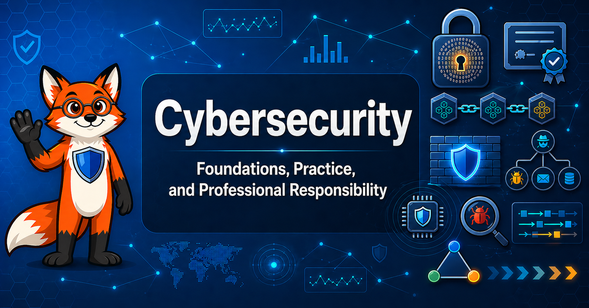

# Cybersecurity

<figure markdown>
  { width="100%" }
</figure>

Welcome. This is an **interactive intelligent textbook** for undergraduate students of cybersecurity, computer science, and information systems — and for the instructors, curriculum designers, and working practitioners who support them. It is aligned to the **ABET Computing Accreditation Commission Cybersecurity Program Criteria** and the eight knowledge areas of the **CSEC2017** Joint Task Force curriculum.

The book's central habit is simple enough for a student to remember and important enough to last a career: ***Trust, but verify.*** Every protocol, every control, and every assumption deserves the question, *"How would an adversary abuse this, and what is the blast radius if they do?"*

## What You'll Find Here

- **16 [chapters](./chapters/index.md)** of structured reading covering security foundations, cryptography, software and component security, network and system defense, human and organizational security, societal context, operations, and emerging topics
- **Interactive [MicroSims](./sims/graph-viewer/index.md)** — browser-based simulations that let students manipulate cryptographic operations, explore protocols, and discover principles through experimentation rather than memorization
- A friendly red-fox mascot named **Sentinel** who models adversarial-but-principled thinking at chapter openings, key insights, common footguns, and difficulty spikes
- A complete **[learning graph](./learning-graph/index.md)** of **390 concepts** across **12 taxonomy categories**, an ISO 11179-compliant **[glossary](./glossary.md)**, and annotated references throughout

## Who This Book Is For

- **Students (undergraduate, primarily sophomores–seniors).** Read the chapters in concise, engineering-grounded language with worked examples and interactive simulations.
- **Instructors.** Use the textbook as a primary or supplementary text in an ABET-accredited cybersecurity, CS, or IS program, with the learning graph as a tool for prerequisite mapping and curriculum review.
- **Practitioners and continuing-education students.** Use the chapters as a structured refresher across the eight CSEC2017 knowledge areas — cryptography, software, component, connection, system, human, organizational, and societal security.

## Get Started

- [About This Book](about.md) — purpose, audience, design, and the team behind it
- [Course Description](course-description.md) — formal overview, ABET alignment, and learning outcomes
- [Chapter 1: Security Foundations](chapters/01-security-foundations/index.md) — start reading
- [Learning Graph](learning-graph/index.md) — explore the 390 concepts and how they connect

## Standards Alignment

This curriculum is anchored in the **ABET Computing Accreditation Commission Cybersecurity Program Criteria** and the **CSEC2017 Joint Task Force** curriculum, covering all eight knowledge areas: **Data, Software, Component, Connection, System, Human, Organizational, and Societal Security.** Learning outcomes are organized using the **revised 2001 Bloom's Taxonomy** and contribute directly to all six **ABET Student Outcomes** for computing programs, including the cybersecurity-specific outcome on applying security principles under adversarial conditions.

## License

This work is released under the
[Creative Commons Attribution-NonCommercial-ShareAlike 4.0 International License (CC BY-NC-SA 4.0)](license.md).
You are free to share and adapt the material for non-commercial purposes as
long as you give appropriate credit and share your adaptations under the
same license.
