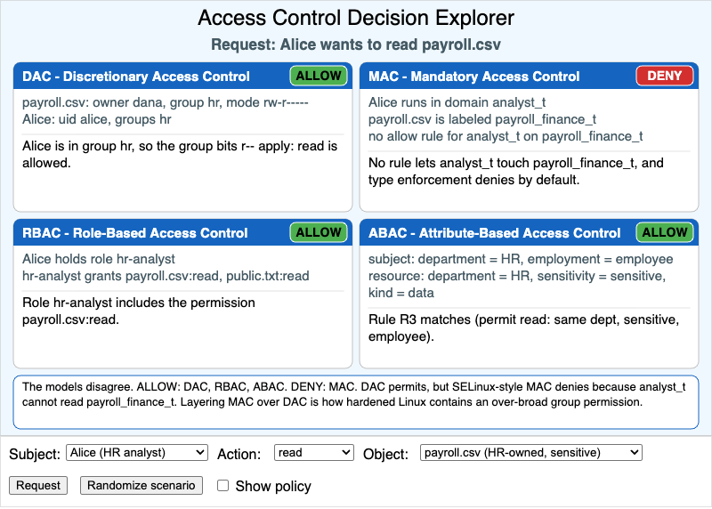

# Access Control Decision Explorer



<iframe src="main.html" width="100%" height="572" scrolling="no"></iframe>

[Run the Access Control Decision Explorer MicroSim Fullscreen](./main.html){ .md-button .md-button--primary }

You can include this MicroSim on your own page with the following `iframe`:

```html
<iframe src="https://dmccreary.github.io/cybersecurity/sims/access-control-explorer/main.html" height="572" width="100%" scrolling="no"></iframe>
```

## About this MicroSim

The four classical access-control models are usually taught as four separate
definitions. This MicroSim puts them side by side on one question: *may this
subject perform this action on this object?* Pick a **Subject** (Alice the HR
analyst, Bob the engineer, Charlie the intern, or root), an **Action** (read,
write, execute), and an **Object** (`payroll.csv`, `build.sh`, or
`public.txt`). Each of the four panels then shows the slice of policy that its
model consults:

- **DAC** looks at the file's owner, group, and nine permission bits, plus
  root's override.
- **MAC** looks at SELinux-style type enforcement: the subject's domain, the
  object's type, and whether an `allow` rule connects them. The default is deny.
- **RBAC** looks at the roles the subject holds and the permissions each role
  grants.
- **ABAC** looks at attributes of the subject and the resource and tests them
  against a short list of permit rules. The default is deny.

Changing any dropdown hides the decisions and replaces each badge with a
question mark. That is deliberate: read the policy shown in each panel, decide
for yourself whether that model will allow or deny, and then press **Request**
to reveal the green **ALLOW** or red **DENY** badges with a one-sentence
rationale. The strip at the bottom compares the four answers and, when the
models disagree, explains what the disagreement shows.

**Randomize scenario** picks a new request for you to predict. **Show policy**
switches every panel from the relevant slice to the model's complete rule set,
with the rule that decided the request highlighted.

The default request, Alice reading `payroll.csv`, already shows a disagreement:
DAC, RBAC, and ABAC allow it, and MAC denies it. Two more worth finding are
root reading `payroll.csv` (only DAC says yes) and Charlie executing `build.sh`
(the group execute bit lets an intern run what the other three models forbid).

All subjects, objects, and policies are in `data.json`, and the sketch contains
a small policy engine that reads only that file. Instructors can add a subject,
change a permission mode, or write a new ABAC rule without editing JavaScript.

## Lesson Plan

**Learning objective (Bloom: Analyze).** Given a request from a subject to
perform an action on an object, learners predict and compare how DAC, MAC,
RBAC, and ABAC each render the access decision, and identify which models would
forbid an apparently reasonable request.

**Suggested classroom use (15 minutes).**

1. *Read the default.* With Alice / read / `payroll.csv` showing, have students
   explain in their own words why MAC is the only model that denies.
2. *Predict, then check.* Press **Randomize scenario** five times. For each
   request, students write down four predictions before pressing **Request**,
   and record which model they got wrong most often.
3. *Hunt for disagreements.* Of the 36 possible requests, seven split the models.
   Have pairs find as many as they can and classify each: is one model too
   permissive, or is one too strict?
4. *Read the whole policy.* Turn on **Show policy** and ask which model's rule
   set would be easiest to audit, and which would be easiest to extend to a
   hundred new employees.

**Discussion questions:**

1. root can read `payroll.csv` under DAC but not under MAC, RBAC, or ABAC. What
   does that tell you about where each model places the authority to set
   policy?
2. Charlie can execute `build.sh` under DAC only. What single change to the
   file's mode would close that gap, and who else would it affect?
3. ABAC denies root reading `build.sh`, although a sysadmin reading a build
   script seems reasonable. Is the policy wrong, or is the request less
   reasonable than it looks? How would you rewrite rule R2?
4. Linux uses DAC with MAC layered on top. Using the default request, explain
   what the combined decision is and why layering the two is safer than either
   alone.

## References

- [Discretionary access control — Wikipedia](https://en.wikipedia.org/wiki/Discretionary_access_control)
- [Mandatory access control — Wikipedia](https://en.wikipedia.org/wiki/Mandatory_access_control)
- [Role-based access control — Wikipedia](https://en.wikipedia.org/wiki/Role-based_access_control)
- [Attribute-based access control — Wikipedia](https://en.wikipedia.org/wiki/Attribute-based_access_control)
- [NIST SP 800-162: Guide to Attribute Based Access Control (ABAC) Definition and Considerations](https://csrc.nist.gov/pubs/sp/800/162/upd2/final)
- [Security-Enhanced Linux — Wikipedia](https://en.wikipedia.org/wiki/Security-Enhanced_Linux)

## Specification

The full specification below is extracted from
[Chapter 10: "System Security: OS, Memory, and Access Control"](../../chapters/10-system-security/index.md).

```text
Type: microsim
sim-id: access-control-explorer
Library: p5.js
Status: Specified

Learning objective (Bloom: Analyzing): Given a request from a subject to
perform an action on an object, learners predict and compare how DAC, MAC,
RBAC, and ABAC each render the access decision, and identify which models
would forbid an apparently reasonable request.

Controls: Subject dropdown (Alice the HR analyst, Bob the engineer, Charlie
the intern, root), Action dropdown (read, write, execute), Object dropdown
(payroll.csv, build.sh, public.txt), a Request button, a Randomize scenario
button, and a Show policy toggle.

Visual elements: four panels in a 2x2 grid, one per model, each showing the
model name, the policy snippet relevant to the request, and a green ALLOW or
red DENY badge with the rationale; a bottom strip comparing the four answers
and noting any disagreement.

Implementation: p5.js sketch with a small policy engine in JavaScript. The
policy data lives in data.json so instructors can edit subjects, objects, and
policies without touching the sketch.
```

**Implementation notes.** Four choices differ from the specification.
(1) The specification asks both for a **Request** button that triggers the
evaluation and for badges that update the moment a dropdown changes. Because
the learning objective says learners *predict* first, changing a dropdown here
hides the badges until **Request** is pressed; the policy text still updates
immediately. (2) The dropdowns and buttons sit in the control region below the
drawing, following the MicroSim layout standard, rather than in a panel at the
top. (3) **Show policy** expands the full rule set inside each model's own
panel instead of opening a side drawer, so no panel is covered. (4) The canvas
is 570 px high rather than 480, and the 2 × 2 grid is kept at every width
(with smaller text on narrow screens) because the iframe height is fixed.

## Related Resources

- [Chapter 10: "System Security: OS, Memory, and Access Control"](../../chapters/10-system-security/index.md)
- [Layers of Access Control on a Modern Linux Box](../linux-ac-layers/index.md)
