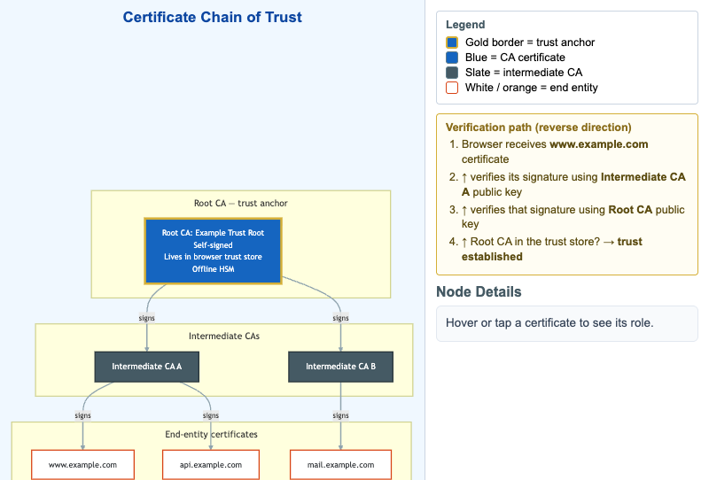

# Certificate Chain of Trust



<iframe src="main.html" width="100%" height="542" scrolling="no"></iframe>

[Run MicroSim in Fullscreen](main.html){ .md-button .md-button--primary }

You can include this MicroSim on your own page with the following `iframe`:

```html
<iframe src="https://dmccreary.github.io/cybersecurity/sims/certificate-chain-of-trust/main.html" height="542" width="100%" scrolling="no"></iframe>
```

## About this MicroSim

This diagram shows how public-key infrastructure (PKI) builds trust as a chain.
At the top is a **Root CA** whose certificate is self-signed, lives in your
browser's trust store, and is protected by an offline hardware security module —
the gold border marks it as the **trust anchor**. The root signs two
**intermediate CAs**, which in turn sign the **end-entity certificates** for
`www.example.com`, `api.example.com`, and `mail.example.com`.

The arrows in the diagram point in the direction signatures flow (top down), but
trust is *verified* in the opposite direction. The amber **Verification path**
callout on the right walks that reverse direction: the browser receives the leaf
certificate, verifies it with the intermediate's public key, verifies the
intermediate with the root's public key, and finally checks that the root is in
its trust store.

Hover over (or tap) any certificate node to read its specific role in the chain.
The legend keys the colors: gold border for the trust anchor, blue for CA
certificates, slate for intermediates, and white-with-orange for end entities.
The layout stacks to a single column on narrow screens.

## Lesson Plan

**Learning objective (Bloom: Understand).** Students will explain how a
certificate chain links an end-entity certificate back to a trusted root, and
trace the reverse verification path a browser walks to establish trust.

**Suggested classroom use.** Have students hover each node top-to-bottom to learn
roles, then read the Verification path callout bottom-to-top and articulate why
the directions are opposite. Connect to a live `openssl s_client` or browser
certificate-viewer demonstration if time allows.

**Discussion questions:**

1. Why is the root key kept offline in an HSM while intermediates sign
   certificates every day? What does this buy you if an intermediate is breached?
2. A server presents its leaf certificate but forgets to send the intermediate.
   Why might some clients still succeed while others fail?
3. The arrows say "signs" top-down, but verification runs bottom-up. Explain in
   your own words why both directions are correct.

## References

- [Public key infrastructure — Wikipedia](https://en.wikipedia.org/wiki/Public_key_infrastructure)
- [Certificate authority — Wikipedia](https://en.wikipedia.org/wiki/Certificate_authority)
- [Chain of trust — Wikipedia](https://en.wikipedia.org/wiki/Chain_of_trust)
- [X.509 — Wikipedia](https://en.wikipedia.org/wiki/X.509)

## Specification

The full specification below is extracted from
[Chapter 4: "Cryptography in Practice: PKI, TLS, and Data Protection"](../../chapters/04-crypto-in-practice/index.md).

```text
Type: diagram
sim-id: certificate-chain-of-trust
Library: Mermaid
Status: Specified

A vertical hierarchy with three tiers:

Top tier — Root CA: single self-signed node (blue, gold border = trust anchor),
tagged "Lives in browser trust store, offline HSM."

Middle tier — Intermediates: two sibling slate nodes, each signed by the Root CA.

Bottom tier — End-entity certificates: three leaf nodes (white, orange border)
each signed by one of the intermediates.

A "Verification path" callout shows the reverse direction: browser receives the
leaf cert, verifies with the intermediate public key, verifies with the root
public key, checks the root is in the trust store -> trust established.

A legend explains the colors: gold border = trust anchor, blue = CA cert, white =
end entity. Responsive: stacks at narrow widths.

Implementation: Mermaid graph TB with subgraphs for each tier.
```

## Related Resources

- [Chapter 4: "Cryptography in Practice: PKI, TLS, and Data Protection"](../../chapters/04-crypto-in-practice/index.md)
