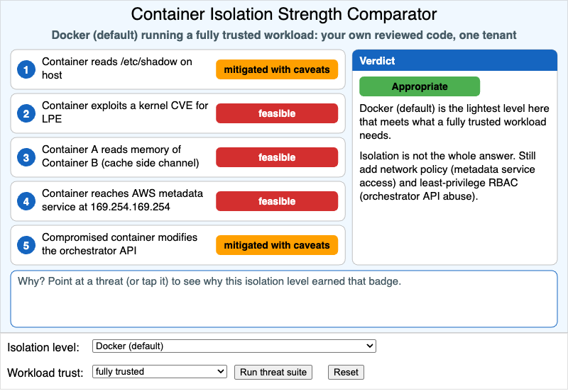

# Container Isolation Strength Comparator



<iframe src="main.html" width="100%" height="552" scrolling="no"></iframe>

[Run the Container Isolation Strength Comparator MicroSim Fullscreen](./main.html){ .md-button .md-button--primary }

You can include this MicroSim on your own page with the following `iframe`:

```html
<iframe src="https://dmccreary.github.io/cybersecurity/sims/container-isolation-comparator/main.html" height="552" width="100%" scrolling="no"></iframe>
```

## About this MicroSim

"Is a container isolated enough?" has no answer until you say *isolated from
what, and for which workload*. This MicroSim turns that question into a test
you can run. Choose an **Isolation level** — `chroot`, Docker with its default
settings, Docker hardened with a non-root user, dropped capabilities, seccomp,
and a MAC profile, a KVM virtual machine, or a VM with confidential computing —
and a **Workload trust** level: fully trusted (your own reviewed code),
semi-trusted (third-party images and dependencies), or hostile multi-tenant
(arbitrary code from strangers). Then press **Run threat suite**.

Five threat scenarios are evaluated against the chosen isolation level:

1. Container reads `/etc/shadow` on the host
2. Container exploits a kernel CVE for local privilege escalation
3. Container A reads memory of Container B through a cache side channel
4. Container reaches the AWS metadata service at 169.254.169.254
5. Compromised container modifies the orchestrator API

Each gets a badge: green **blocked**, amber **mitigated with caveats**, or red
**feasible**. Point at a threat (or tap it) and the box below explains *why* in
one sentence tied to a concept from the chapter: namespaces, capabilities,
seccomp, MAC profiles, or hardware-assisted virtualization.

The **Verdict** panel compares the badges with what the workload actually
requires and returns one of three judgments. *Not appropriate* names the
threats on which the level falls short and the lightest level that would do.
*Appropriate* means this is the lightest level that meets the need. *More than
needed* means the level is safe but a lighter one would have been enough, and
states what the extra margin costs.

Changing either dropdown hides the badges until the suite is run again, so you
can make your own judgment first. Two patterns are worth looking for. No
isolation level turns threats 4 and 5 green: reaching the metadata service and
abusing the orchestrator API are stopped by network policy and least-privilege
RBAC, not by a stronger sandbox. And confidential computing does not beat a
plain VM on any of these five threats, because it protects the workload from
the host rather than the host from the workload.

The isolation-level-to-threat matrix, the workload requirements, and all
rationale text are in `data.json`. Instructors can add a threat scenario or an
isolation level (gVisor or Kata Containers, for example) by editing that file.

## Lesson Plan

**Learning objective (Bloom: Evaluate).** Given a hypothetical workload
(trusted, semi-trusted, hostile multi-tenant), learners select an isolation
level and evaluate whether each available threat — host filesystem access,
kernel exploit, sibling-container interference, hardware side channel — is
mitigated.

**Suggested classroom use (15 minutes).**

1. *Start from the default.* Docker (default) with a fully trusted workload is
   judged appropriate even though three badges are red. Ask students to defend
   or attack that verdict.
2. *Raise the stakes.* Keep Docker (default), switch the workload to hostile
   multi-tenant, and have students predict the verdict and which threats are
   responsible before pressing **Run threat suite**.
3. *Find the lightest fit.* For each of the three workloads, students find the
   lightest isolation level that earns *Appropriate* and justify it from the
   rationale text.
4. *Explain the stubborn rows.* Students explain why threats 4 and 5 never turn
   green, and name the control that would close each one.

**Discussion questions:**

1. Hardened Docker changes threat 1 from amber to green and threat 2 from red
   to amber, but leaves threat 3 red. What do capabilities, seccomp, and MAC
   have in common that makes them unable to address a cache side channel?
2. A serverless platform runs untrusted customer functions. Which isolation
   level would you choose, and what does the "more than needed" verdict for a
   confidential VM tell you about matching a control to a threat model?
3. The verdict for a VM with a hostile workload is *Appropriate*, yet it still
   lists two controls to add. Why is the isolation boundary necessary but not
   sufficient?
4. Your team proposes running a vendor's image with `--privileged` "because it
   will not start otherwise." Using the badges, describe what that flag would
   do to the Docker (default) column.

## References

- [OS-level virtualization — Wikipedia](https://en.wikipedia.org/wiki/OS-level_virtualization)
- [Linux namespaces — Wikipedia](https://en.wikipedia.org/wiki/Linux_namespaces)
- [seccomp — Wikipedia](https://en.wikipedia.org/wiki/Seccomp)
- [Kernel-based Virtual Machine — Wikipedia](https://en.wikipedia.org/wiki/Kernel-based_Virtual_Machine)
- [Confidential computing — Wikipedia](https://en.wikipedia.org/wiki/Confidential_computing)
- [NIST SP 800-190: Application Container Security Guide](https://csrc.nist.gov/pubs/sp/800/190/final)
- [Docker Engine security — Docker Docs](https://docs.docker.com/engine/security/)

## Specification

The full specification below is extracted from
[Chapter 10: "System Security: OS, Memory, and Access Control"](../../chapters/10-system-security/index.md).

```text
Type: microsim
sim-id: container-isolation-comparator
Library: p5.js
Status: Specified

Learning objective (Bloom: Evaluating): Given a hypothetical workload (trusted,
semi-trusted, hostile multi-tenant), learners select an isolation level and
evaluate whether each available threat — host filesystem access, kernel
exploit, sibling-container interference, hardware side channel — is mitigated.

Controls: Isolation level select (chroot, Docker default, Docker hardened,
VM (KVM), VM + confidential computing), Workload trust select (fully trusted,
semi-trusted, hostile multi-tenant), Run threat suite button, Reset button.

Visual elements: a vertical list of five threat scenarios, each with a green
"blocked", amber "mitigated with caveats", or red "feasible" badge; a "Why?"
hover with a one-sentence rationale; a Verdict panel recommending whether the
chosen isolation is appropriate for the chosen workload.

Implementation: p5.js sketch with the isolation-level to threat-mitigation
matrix in data.json. Instructors can extend with new scenarios by editing the
JSON.
```

**Implementation notes.** Three choices differ from the specification.
(1) The "Why?" rationale appears in a fixed box under the threat list instead
of a floating tooltip, and a tap pins it, so it works on touch screens and is
never clipped by the iframe edge. (2) The threat list stays in a single column
at every width rather than splitting into two columns above 900 px; on screens
narrower than 560 px the verdict moves into the box under the list. (3) The
controls sit in the control region below the drawing, following the MicroSim
layout standard, and the canvas is 550 px high rather than 540. The badge for
each threat depends only on the isolation level; the workload trust level
decides which badges are acceptable and therefore the verdict.

## Related Resources

- [Chapter 10: "System Security: OS, Memory, and Access Control"](../../chapters/10-system-security/index.md)
- [Hypervisor Architecture and the Trust Boundary](../hypervisor-architecture/index.md)
- [Kernel / User Mode Boundary](../kernel-user-boundary/index.md)
