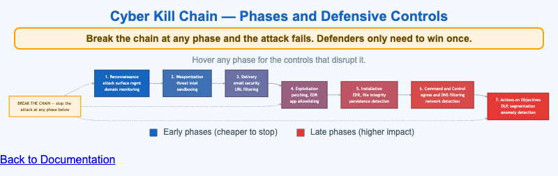

# Cyber Kill Chain Phases with Defensive Controls



<iframe src="main.html" width="100%" height="252" scrolling="no"></iframe>

[Run the Cyber Kill Chain Controls MicroSim Fullscreen](main.html){ .md-button .md-button--primary }

You can include this MicroSim on your own website with the following `iframe`:

```html
<iframe src="https://dmccreary.github.io/cybersecurity/sims/cyber-kill-chain-controls/main.html" height="430" width="100%" scrolling="no"></iframe>
```

## About this MicroSim

This diagram lays out the seven phases of the **Cyber Kill Chain** as a left-to-right
flow — Reconnaissance, Weaponization, Delivery, Exploitation, Installation, Command
and Control, and Actions on Objectives. The boxes shade from cybersecurity blue at
the early, cheap-to-stop phases to red at the late, high-impact phases, so the cost
gradient of waiting to respond is visible at a glance.

Each phase box lists the defensive controls that disrupt it, and hovering (or
tapping) a phase reveals a fuller description of what the attacker is doing there
and the controls that break it. Above the flow, the amber "Break the Chain" callout
feeds a dashed arrow into every phase to make the central idea concrete: a defender
does not have to win at every phase — disrupting any *single* phase makes the whole
attack fail. That asymmetry, in the defender's favor for once, is the reason
defense-in-depth across the chain is so effective.

## Lesson Plan

**Learning objective (Bloom — Understand):** Students can map each Cyber Kill Chain
phase to the controls that disrupt it and explain why breaking the chain at any one
phase defeats the attack.

**Suggested classroom use:** Walk the chain left to right, hovering each phase to
read its controls. Then ask students to pick the phase they would invest in first
and defend the choice on cost and blast-radius grounds. Connect the controls to
tools the class has already seen (EDR, DNS filtering, DLP).

**Discussion questions:**

1. Why is it generally cheaper and safer to break the chain at Reconnaissance or
   Delivery than at Actions on Objectives?
2. Several controls (EDR, for example) appear in more than one phase. What does that
   tell you about how to prioritize tooling?
3. The model assumes a linear attack. Where does the real world deviate from this
   neat left-to-right sequence?

## References

- [Cyber kill chain (Wikipedia)](https://en.wikipedia.org/wiki/Kill_chain#The_cyber_kill_chain)
- [Lockheed Martin — The Cyber Kill Chain](https://www.lockheedmartin.com/en-us/capabilities/cyber/cyber-kill-chain.html)
- [MITRE ATT&CK (a complementary, non-linear model)](https://attack.mitre.org/)

## Specification

The full specification below is extracted from
[Chapter 2: "Threats, Vulnerabilities, and Security Controls"](../../chapters/02-threats-and-controls/index.md).

```text
Type: workflow-diagram
**sim-id:** cyber-kill-chain-controls<br/>
**Library:** Mermaid<br/>
**Status:** Specified

A horizontal flow with 7 boxes representing the kill chain phases:

1. **Reconnaissance** → controls: external attack surface management, domain monitoring
2. **Weaponization** → controls: threat intelligence, sandboxing, anti-exploit
3. **Delivery** → controls: email security, URL filtering, attachment scanning
4. **Exploitation** → controls: patching, EDR, application allowlisting
5. **Installation** → controls: EDR, file integrity monitoring, persistence detection
6. **Command and Control** → controls: egress filtering, DNS filtering, network detection
7. **Actions on Objectives** → controls: DLP, segmentation, anomaly detection

Each phase is a colored box (gradient from blue at left to red at right). Below each phase, a small list of 2-3 control examples appears. Arrows between phases imply progression. A "break the chain" callout sits above the flow, with a downward arrow into each phase, captioned: "Stop the chain at any phase and the attack fails."

Color: cybersecurity blue (#1565c0) shading deeper through the chain. Responsive: stacks vertically below 800px viewport with phase titles and bullet lists.

Implementation: Mermaid graph LR with styled subgraphs.
```

## Related Resources

- [Chapter 2: "Threats, Vulnerabilities, and Security Controls"](../../chapters/02-threats-and-controls/index.md)
