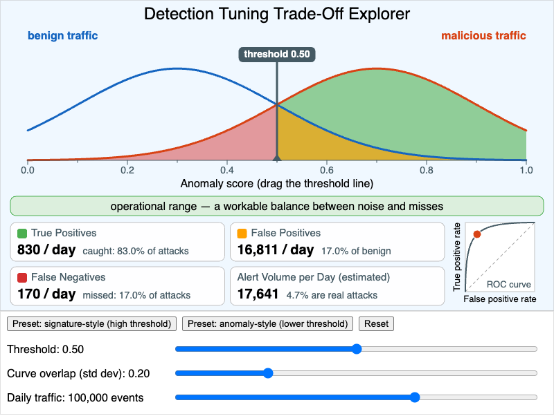

# Detection Tuning Trade-Off Explorer



<iframe src="main.html" width="100%" height="602" scrolling="no"></iframe>

[Run the Detection Tuning Trade-Off Explorer MicroSim Fullscreen](./main.html){ .md-button .md-button--primary }

You can include this MicroSim on your own page with the following `iframe`:

```html
<iframe src="https://dmccreary.github.io/cybersecurity/sims/detection-threshold-explorer/main.html" height="602" width="100%" scrolling="no"></iframe>
```

## About this MicroSim

Every IDS, IPS, EDR, and SIEM rule ultimately reduces to a question: *how
suspicious does an event have to look before we alert on it?* This MicroSim
makes that question concrete. The blue curve is the distribution of anomaly
scores for **benign traffic** and the orange curve is the distribution for
**malicious traffic**. They overlap, because real attacks sometimes look
ordinary and ordinary traffic sometimes looks strange. The slate vertical line
is the **detection threshold**: everything to its right raises an alert.

Drag the line (or use the **Threshold** slider) and the shaded areas change:

- **Green** — malicious events above the threshold: *true positives*.
- **Amber** — benign events above the threshold: *false positives*.
- **Red** — malicious events below the threshold: *false negatives*, the missed attacks.
- Unshaded — benign events below the threshold: *true negatives*.

The four readouts convert those areas into events per day using the **Daily
traffic** slider (log-scaled from 1,000 to 1,000,000 events) and a fixed
assumption that 1% of events are malicious. The small chart on the right plots
the current operating point on the **ROC curve** for the chosen amount of curve
overlap. The caption names the zone you are in: the *alert fatigue zone* when
more than a quarter of benign events alert, the *missed-attack zone* when fewer
than half of the attacks alert, the *operational range* in between, and a
*no-win zone* when the curves overlap so much that both problems occur at once.

The lesson hiding in the **Alert Volume** readout is the base-rate effect.
Because benign traffic outnumbers attacks 99 to 1, even a modest false-positive
rate produces far more false alerts than true ones — at the default settings
fewer than 5% of the alerts an analyst sees are real. Moving the threshold
never removes that tension; it only chooses which kind of error you pay for.
The only way to get both a high catch rate and a quiet queue is a better
detector, which is what lowering **Curve overlap** simulates.

The two preset buttons contrast the tuning styles from the chapter: a
**signature-style** detector sits at a high threshold (0.85) and stays quiet
but passes over anything that does not match closely, while an
**anomaly-style** detector sits lower (0.55) and catches more at the price of
noise. The numbers come from a simple two-Gaussian teaching model, not from a
measured detector.

## Lesson Plan

**Learning objective (Bloom: Analyze).** Students will analyze how the choice
of detection threshold trades off true-positive rate against false-positive
rate, and will reason about the operational consequences (alert fatigue, missed
attacks) of the two extremes.

**Suggested classroom use (10–15 minutes).**

1. *Predict.* With the defaults showing, ask students to predict what happens
   to each of the four readouts if the threshold moves to 0.85. Then press the
   signature-style preset and compare.
2. *Explore the extremes.* Have students drag the threshold to each end of the
   axis and record the alert volume and the percentage of alerts that are real.
3. *Change the problem, not the threshold.* Reset, then move **Curve overlap**
   from 0.20 down to 0.10 and up to 0.40 while watching the ROC curve bend
   toward or away from the top-left corner.
4. *Scale it.* Hold the threshold fixed and sweep **Daily traffic** from 1,000
   to 1,000,000 events. Students should notice that the rates do not change but
   the analyst workload does.

**Discussion questions:**

1. At the default settings the detector catches most attacks, yet fewer than
   one alert in twenty is real. Which number in the model is responsible for
   that, and why can't threshold tuning fix it?
2. A SOC has three analysts who can each triage about 100 alerts per day. With
   100,000 events per day and the default overlap, where must the threshold sit,
   and what fraction of attacks does the team then miss?
3. An IPS drops traffic above the threshold instead of only alerting. How does
   that change which type of error is more expensive, and which way would you
   move the threshold?
4. Find a setting that lands in the *no-win zone*. What would you have to change
   about the detector, rather than the threshold, to get out of it?

## References

- [Receiver operating characteristic — Wikipedia](https://en.wikipedia.org/wiki/Receiver_operating_characteristic)
- [Base rate fallacy — Wikipedia](https://en.wikipedia.org/wiki/Base_rate_fallacy)
- [Intrusion detection system — Wikipedia](https://en.wikipedia.org/wiki/Intrusion_detection_system)
- [Alarm fatigue — Wikipedia](https://en.wikipedia.org/wiki/Alarm_fatigue)
- Axelsson, S. (2000). *The Base-Rate Fallacy and the Difficulty of Intrusion Detection.* ACM Transactions on Information and System Security, 3(3).

## Specification

The full specification below is extracted from
[Chapter 8: "Network Security Foundations: Protocols, Firewalls, and Detection"](../../chapters/08-network-foundations/index.md).

```text
Type: microsim
sim-id: detection-threshold-explorer
Library: p5.js
Status: Specified

Learning objective (Bloom: Analyze): Students will analyze how the choice of
detection threshold trades off true-positive rate against false-positive rate,
and will reason about the operational consequences (alert fatigue, missed
attacks) of the two extremes.

Visual layout: two overlapping bell curves on an "anomaly score" axis (benign
centered at 0.3, malicious centered at 0.7) crossed by a draggable threshold
line. True positives shaded green, false positives amber, false negatives red.
Four live readouts (True Positives, False Positives, False Negatives, Alert
Volume per Day) and a small ROC chart showing the current operating point.

Controls: sliders for Threshold (0.0-1.0), Curve overlap (0.1-0.5), and Daily
traffic volume (1,000-1,000,000, log-scaled); preset buttons for
signature-style (0.85) and anomaly-style (0.55) thresholds; Reset.

Behavior: readouts update in real time; a caption names the alert fatigue
zone, the missed-attack zone, or the operational range.

Defaults: threshold 0.5, overlap 0.2, traffic 100,000 events/day.
```

**Implementation notes.** The drawing region is taller than the 800 × 500 in
the specification (the canvas is 600 px high) so that the four readouts, the
ROC chart, and three slider rows all fit without overlap. Three modeling
choices are not in the specification and were added so the numbers are
well-defined: the two normal curves are truncated to the visible 0–1 score
axis, 1% of events are assumed malicious, and the zone caption is driven by
rates (false-positive rate above 25%, true-positive rate below 50%) rather
than fixed threshold positions, so it stays meaningful when the overlap
changes.

## Related Resources

- [Chapter 8: "Network Security Foundations: Protocols, Firewalls, and Detection"](../../chapters/08-network-foundations/index.md)
- [IDS/IPS Decision Flow](../ids-ips-decision-flow/index.md)
