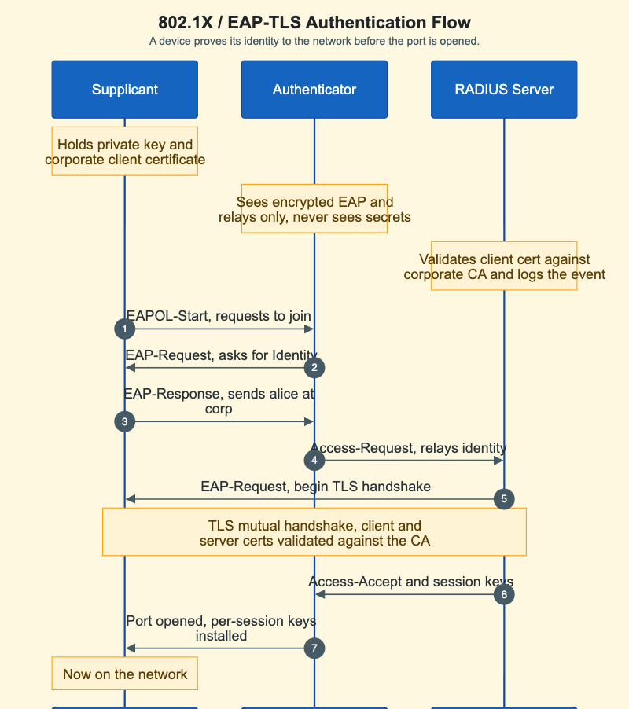

# 802.1X / EAP-TLS Authentication Flow



<iframe src="main.html" width="100%" height="902" scrolling="no"></iframe>

[Run MicroSim in Fullscreen](main.html){ .md-button .md-button--primary }

You can embed this MicroSim in your own course page with the following `iframe`:

```html
<iframe src="https://dmccreary.github.io/cybersecurity/sims/dot1x-eap-tls-flow/main.html"
        width="100%" height="902" scrolling="no"></iframe>
```

## About this MicroSim

This sequence diagram shows how 802.1X port-based network access control
authenticates a device *before* the network port is opened, using EAP-TLS. Three
parties take part: the **Supplicant** (the laptop trying to join, which holds a
private key and a corporate-issued client certificate), the **Authenticator**
(the Wi-Fi access point or switch, which sees only encrypted EAP and relays it),
and the **RADIUS Server** (which validates the client certificate against the
corporate certificate authority and logs the authentication event).

Follow the numbered steps from the EAPOL-Start through the identity exchange, the
relay to RADIUS, and the highlighted **mutual TLS handshake** where the client
and server certificates are exchanged and validated against the corporate CA.
Only after the RADIUS server returns Access-Accept with session keys does the
authenticator open the port and install per-session keys, putting the supplicant
on the network. The key insight, called out in the side notes, is that the
authenticator never sees the secrets — it is a relay, and the actual trust
decision is made by the RADIUS server against the CA. The diagram scales to its
container width.

## Lesson Plan

**Learning objective (Bloom: Understand):** Students will explain the roles of
the supplicant, authenticator, and RADIUS server in an 802.1X / EAP-TLS exchange
and identify where the trust decision is actually made.

**Suggested classroom use:** Walk the numbered steps aloud, pausing at step 4 to
ask "who is talking to whom now, and who can read what?" Highlight that the AP
relays without decrypting, then reach the TLS-handshake box and connect it to the
TLS material from the cryptography chapter.

**Discussion questions:**

1. The authenticator relays EAP but never sees the client's secrets. Why is that
   a security advantage rather than a limitation?
2. Where in this flow is the client certificate actually validated, and against
   what?
3. What would change in this diagram if the network used username/password
   (PEAP-MSCHAPv2) instead of EAP-TLS client certificates?

## References

- [Wikipedia: IEEE 802.1X](https://en.wikipedia.org/wiki/IEEE_802.1X) — the port-based network access control standard shown here.
- [Wikipedia: Extensible Authentication Protocol (EAP)](https://en.wikipedia.org/wiki/Extensible_Authentication_Protocol#EAP-TLS) — the EAP-TLS method used in this flow.
- [Wikipedia: RADIUS](https://en.wikipedia.org/wiki/RADIUS) — the authentication server protocol.
- [RFC 5216: The EAP-TLS Authentication Protocol](https://www.rfc-editor.org/rfc/rfc5216) — the specification for EAP-TLS.

## Specification

The full specification below is extracted from
[Chapter 9: "Advanced Network Defense: Wireless, DNS, and Zero Trust"](../../chapters/09-advanced-network-defense/index.md).

```text
Type: workflow-diagram
**sim-id:** dot1x-eap-tls-flow
**Library:** Mermaid

A sequence diagram with three actors: Supplicant (laptop), Authenticator
(AP/switch), RADIUS Server. Steps: EAPOL-Start; EAP Identity request/response;
Access-Request relay; begin TLS handshake; mutual TLS handshake (client + server
certs validated against corporate CA, highlighted); Access-Accept + session keys;
open port + install keys; now on network. Side notes: supplicant holds private
key + client cert; authenticator relays only and never sees secrets; RADIUS
validates client cert against corporate CA and logs the event. Responsive.
```

## Related Resources

- [Chapter 9: "Advanced Network Defense: Wireless, DNS, and Zero Trust"](../../chapters/09-advanced-network-defense/index.md)
