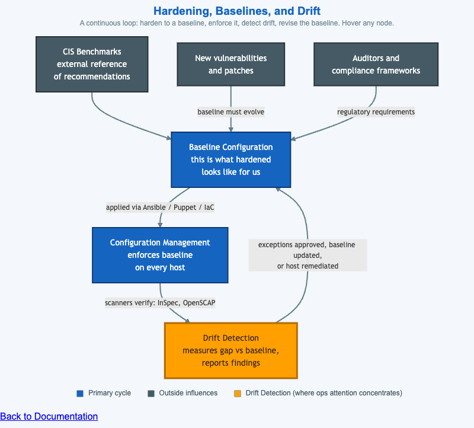

# Hardening, Baselines, and Drift



<iframe src="main.html" width="100%" height="722" scrolling="no"></iframe>

[Run the Hardening Baselines Loop MicroSim Fullscreen](main.html){ .md-button .md-button--primary }

You can include this MicroSim on your own website with the following `iframe`:

```html
<iframe src="https://dmccreary.github.io/cybersecurity/sims/hardening-baselines-loop/main.html" height="722" width="100%" scrolling="no"></iframe>
```

## About this MicroSim

This causal-loop diagram shows that **system hardening is a cycle, not a one-time
task**. A public reference — the **CIS Benchmarks** — seeds a tailored **Baseline
Configuration** ("this is what hardened looks like for us"). **Configuration
Management** (Ansible, Puppet, infrastructure-as-code) enforces that baseline on
every host. **Drift Detection** scanners (InSpec, OpenSCAP) then measure the gap
between each host's real state and the baseline and report findings — and those
findings feed back into the baseline, closing the loop. Hovering any node reveals
its role.

Two outside influences keep the loop turning: **new vulnerabilities and patches**
force the baseline to evolve, and **auditors and compliance frameworks** feed in
regulatory requirements. Drift Detection is highlighted in amber because that is
where ongoing operational attention concentrates — every finding is either an
exception to approve, a baseline to update, or a host to remediate. The arrows
carry the real-world tools and decisions at each transition, and the cycle reflows
to a vertical sequence on narrow screens.

## Lesson Plan

**Learning objective (Bloom — Understand):** Students can explain the continuous
loop among baselines, configuration management, and drift detection, and identify
how outside influences force the baseline to evolve.

**Suggested classroom use:** Trace the clockwise cycle once, then introduce each
outside influence and ask what it changes about the baseline. Spend time on Drift
Detection: for a sample finding, have students decide among approve-exception,
update-baseline, and remediate-host.

**Discussion questions:**

1. Why can a hardening baseline never be considered "finished"?
2. When drift is detected, three responses are possible. What evidence would push
   you toward each one?
3. CIS Benchmarks are a starting point, not the final baseline. Why is blindly
   applying every benchmark setting sometimes the wrong move?

## References

- [CIS Benchmarks (Wikipedia)](https://en.wikipedia.org/wiki/Center_for_Internet_Security)
- [Configuration management (Wikipedia)](https://en.wikipedia.org/wiki/Configuration_management)
- [NIST SP 800-128 — Security-Focused Configuration Management of Information Systems](https://csrc.nist.gov/pubs/sp/800/128/upd1/final)

## Specification

The full specification below is extracted from
[Chapter 11: "Cloud Security and Operations Monitoring"](../../chapters/11-cloud-and-ops-monitoring/index.md).

```text
Type: causal-loop-diagram
**sim-id:** hardening-baselines-loop<br/>
**Library:** Mermaid<br/>
**Status:** Specified

A cyclic diagram with four primary nodes and two outside influences.

**Primary cycle (clockwise, with arrows):**

1. **CIS Benchmarks** (top) — external reference of recommendations
2. → **Baseline Configuration** (right) — codified, named "this is what hardened looks like for us"
3. → **Configuration Management** (bottom) — enforces baseline on every host
4. → **Drift Detection** (left) — measures gap between actual and baseline; reports findings
5. → back into **Baseline Configuration** (the cycle: findings revise baseline)

**Outside influences:**

- **New vulnerabilities / patches** → arrow into **Baseline Configuration** ("baseline must evolve")
- **Auditors / compliance frameworks** → arrow into **Baseline Configuration** ("regulatory requirements feed in")

**Annotations on arrows:**

- Baseline → Config Mgmt: "applied via Ansible/Puppet/IaC"
- Config Mgmt → Drift: "scanners verify (e.g., InSpec, OpenSCAP)"
- Drift → Baseline: "exceptions approved, baseline updated, or host remediated"

Color: cybersecurity blue for the four primary nodes, slate steel for influences, amber #ffa000 highlight on Drift Detection (the place where ops attention concentrates). Responsive: cycle reflows to a vertical sequence below 700px.

Implementation: Mermaid graph TD with curved arrows.
```

## Related Resources

- [Chapter 11: "Cloud Security and Operations Monitoring"](../../chapters/11-cloud-and-ops-monitoring/index.md)
