# List of MicroSims for Cybersecurity

Interactive MicroSims to help students learn cybersecurity fundamentals.

-   **[802.1X / EAP-TLS Authentication Flow](./dot1x-eap-tls-flow/index.md)**

    

    A sequence diagram of 802.1X port-based access control using EAP-TLS, showing how a supplicant authenticates through an authenticator that only relays to a RADIUS server, with the mutual TLS handshake highlighted.

-   **[A Modern Software Supply Chain](./software-supply-chain-flow/index.md)**

    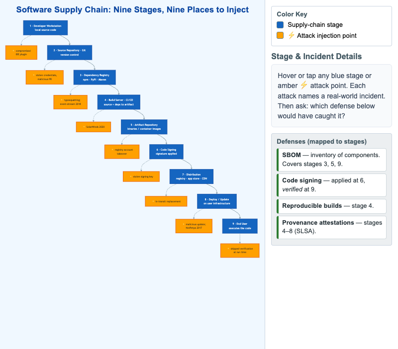

    Interactive Mermaid flow of the nine stages of a software supply chain, each marked with a real-world attack-injection incident, plus the defenses mapped to each stage.

-   **[A TOCTOU Race Condition](./toctou-race/index.md)**

    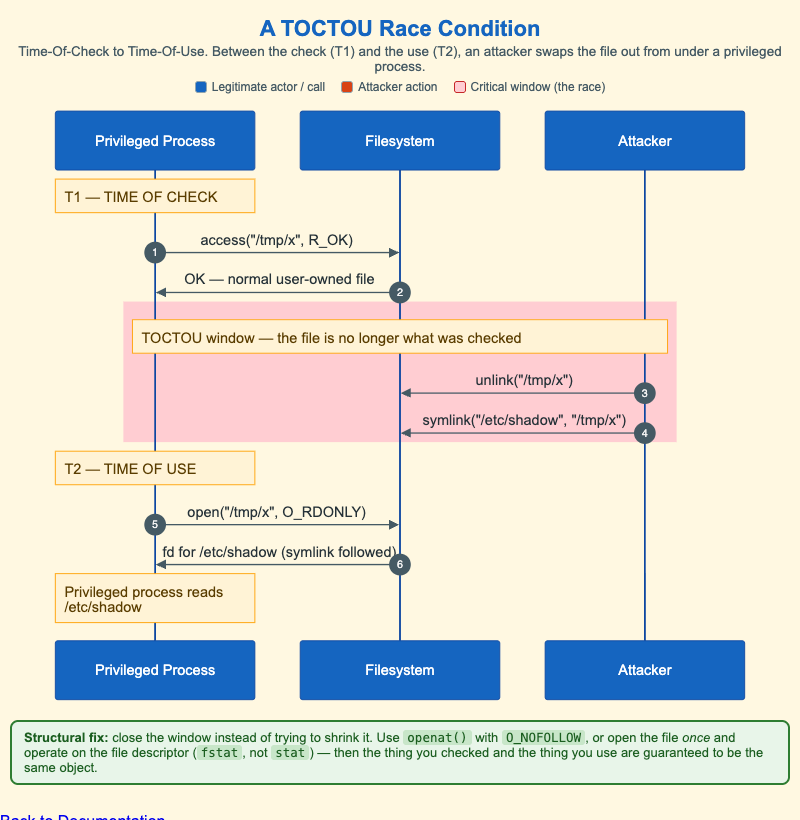

    A Mermaid sequence diagram of a Time-Of-Check to Time-Of-Use (TOCTOU) race condition, showing a symlink-swap attack against a privileged process and the structural fix that eliminates the window.

-   **[AAA Pipeline with Non-Repudiation Sidebar](./aaa-pipeline/index.md)**

    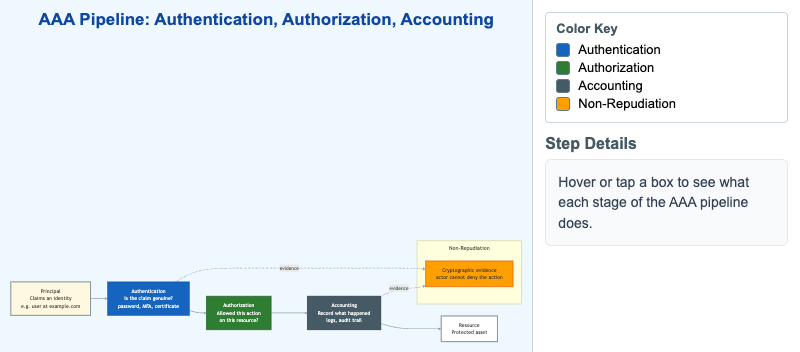

    Interactive Mermaid flow diagram of the Authentication, Authorization, and Accounting pipeline, with a non-repudiation sidebar fed by cryptographic evidence.

-   **[Adversarial Example Explorer](./adversarial-example-explorer/index.md)**

    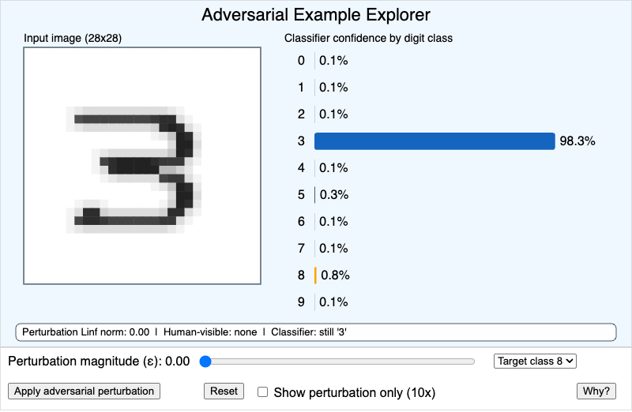

    Add an imperceptible FGSM perturbation to a hand-drawn digit and watch a classifier's confidence flip from the correct class to an attacker-chosen target class.

-   **[Anatomy of an X.509 Certificate](./x509-anatomy/index.md)**

    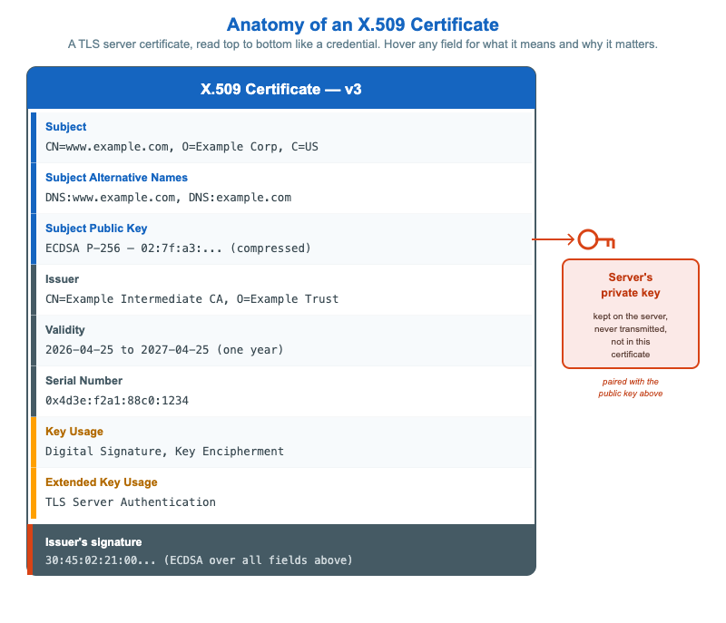

    An interactive SVG infographic of a TLS server certificate drawn as a credential, with hover tooltips on all eight fields and a key icon linking the public key to the server's private key.

-   **[Attack Surface, Trust Boundary, and Blast Radius](./surface-boundary-blast-radius/index.md)**

    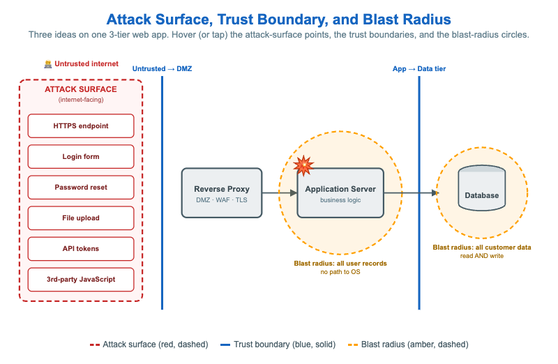

    An interactive SVG of a 3-tier web app distinguishing the red dashed attack surface, two solid blue trust boundaries, and two amber dashed blast-radius circles, with hover tooltips.

-   **[Authentication Mechanism Strength Comparison](./auth-mechanism-comparison/index.md)**

    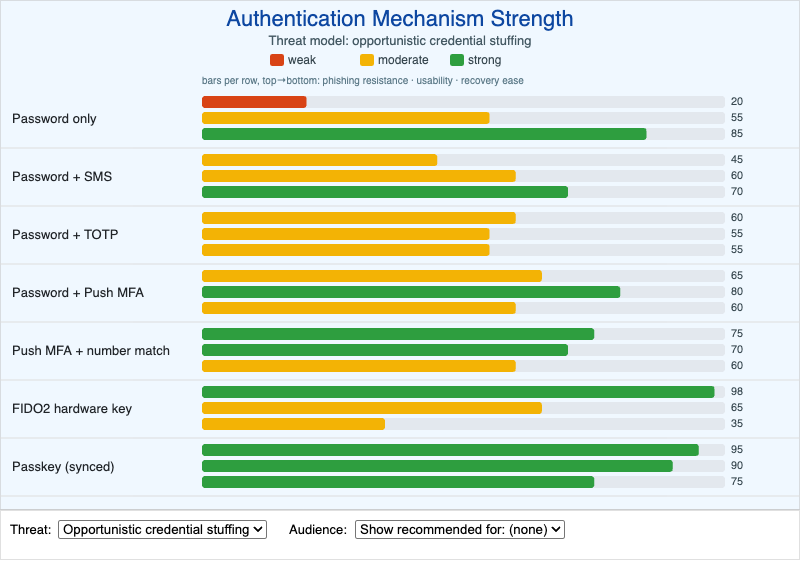

    Interactive p5.js infographic comparing seven authentication mechanisms across phishing resistance, usability, and account-recovery ease, with threat-model and audience toggles.

-   **[Block Cipher Modes Comparison](./block-cipher-modes-compare/index.md)**

    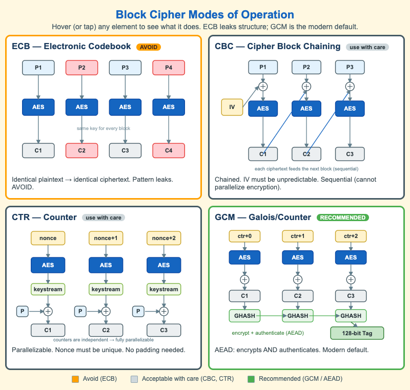

    A hover-annotated 2x2 SVG infographic comparing the ECB, CBC, CTR, and GCM block cipher modes of operation.

-   **[Certificate Chain of Trust](./certificate-chain-of-trust/index.md)**

    

    Interactive Mermaid hierarchy of a PKI certificate chain from a self-signed Root CA through intermediate CAs to end-entity certificates, with a reverse verification-path callout.

-   **[Choosing a Capstone Track](./capstone-track-chooser/index.md)**

    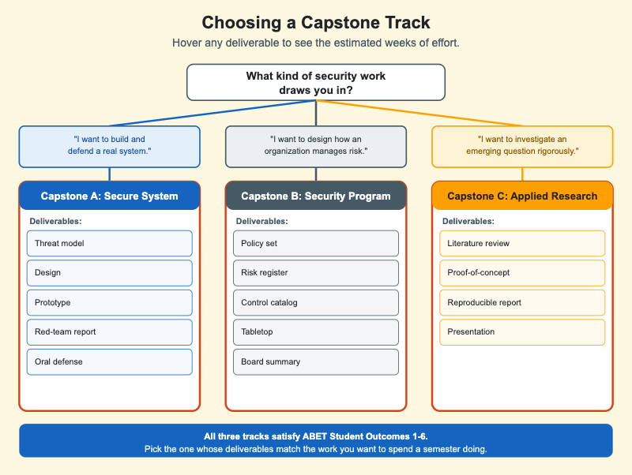

    A three-branch decision tree that helps students choose among a Secure System, Security Program, or Applied Research capstone, with hover tooltips showing the estimated weeks of effort for each deliverable.

-   **[CIA Triad with Example Threats and Controls](./cia-triad-overview/index.md)**

    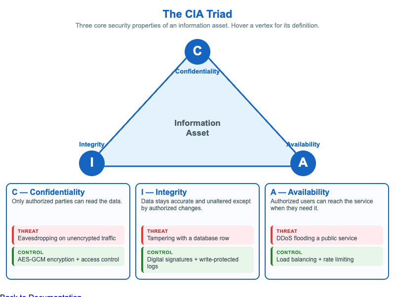

    An interactive SVG of the CIA triad pairing Confidentiality, Integrity, and Availability with an example threat and control for each.

-   **[Classic DMZ Architecture](./classic-dmz-architecture/index.md)**

    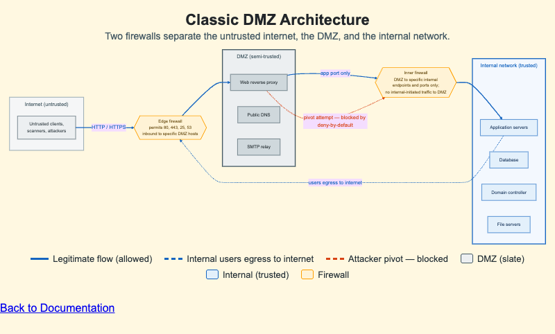

    A Mermaid flowchart showing the classic two-firewall DMZ design with an untrusted internet zone, a semi-trusted DMZ, and a trusted internal network, plus a blocked attacker pivot.

-   **[Cost of Fixing a Bug Across SDLC Phases](./ssdlc-cost-curve/index.md)**

    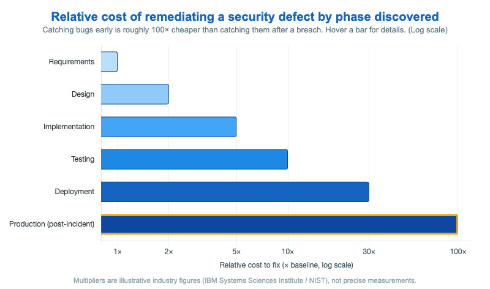

    An interactive Chart.js horizontal bar chart on a logarithmic scale showing how the cost of fixing a security defect grows from 1x in requirements to 100x in production after a breach.

-   **[Coverage-Guided Fuzzer Loop](./fuzzer-coverage-loop/index.md)**

    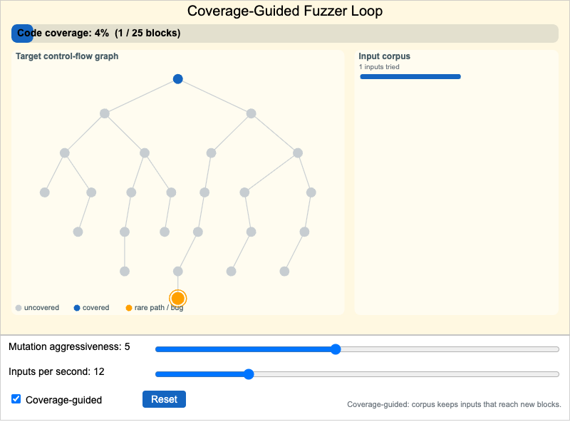

    An animated simulation of how a coverage-guided fuzzer explores a target program's basic blocks over time, reaching the deep bug block far faster than pure random fuzzing.

-   **[Cyber Kill Chain Phases with Defensive Controls](./cyber-kill-chain-controls/index.md)**

    

    An interactive Mermaid flow mapping the seven Cyber Kill Chain phases to the defensive controls that disrupt each one.

-   **[Cyber Law Jurisdictional Map](./cyber-law-jurisdiction-map/index.md)**

    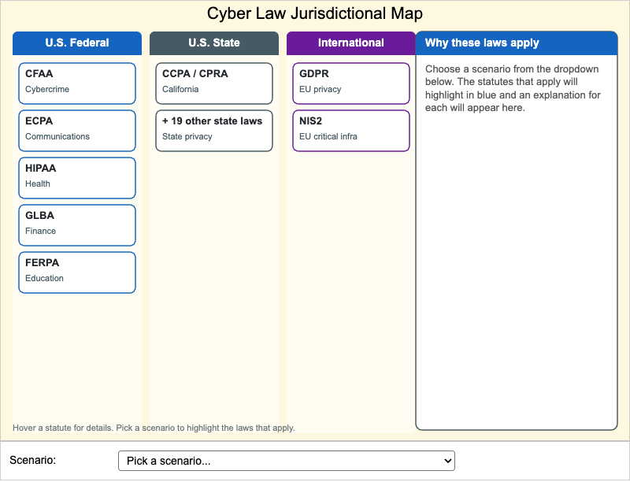

    Statutes grouped into U.S. Federal, U.S. State, and International bands. Hover any law for details; pick a scenario to highlight the laws that apply and read why each reaches it.

-   **[DDoS Mitigation Explorer](./ddos-mitigation-explorer/index.md)**

    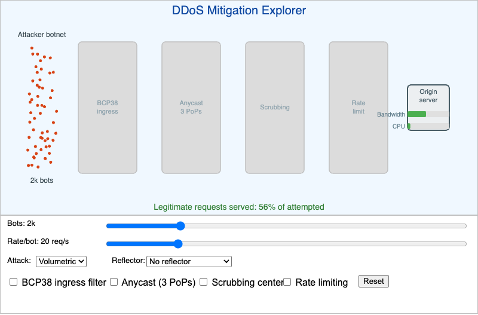

    Interactive p5.js simulation of DDoS attack and defense. Adjust the botnet and attack type, toggle ingress filtering, anycast, scrubbing, and rate limiting, and watch how much traffic reaches the origin.

-   **[Device Attestation Flow](./device-attestation-flow/index.md)**

    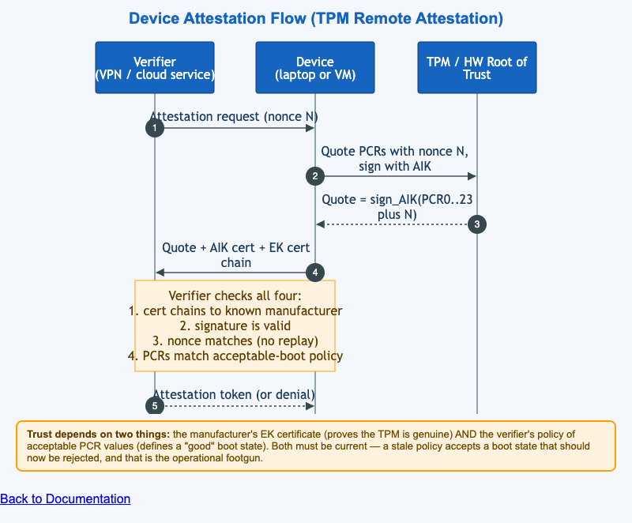

    A Mermaid sequence diagram of TPM-based remote device attestation among a verifier, a device, and the hardware root of trust.

-   **[Diffie-Hellman Key Exchange](./diffie-hellman-exchange/index.md)**

    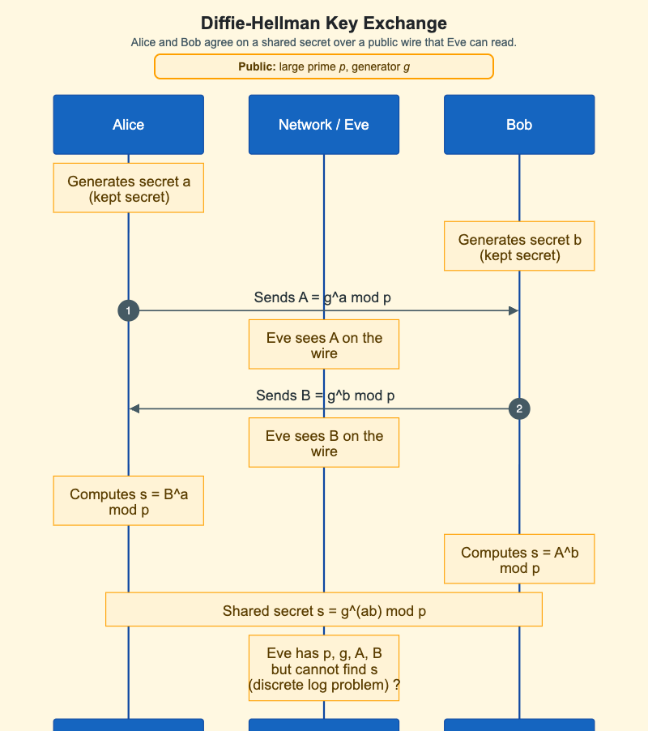

    A sequence diagram of the Diffie-Hellman key exchange showing which values are public, which stay secret, and why an eavesdropper cannot recover the shared secret.

-   **[Digital Signature - Sign and Verify Flow](./digital-signature-flow/index.md)**

    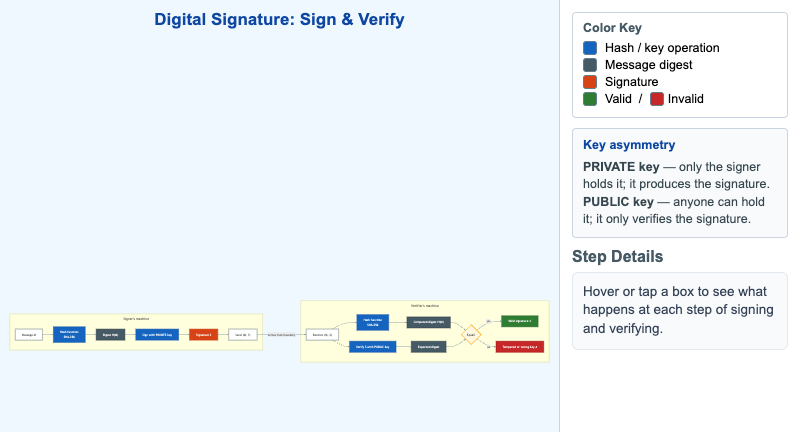

    Interactive Mermaid workflow of digital signing and verification across a trust boundary, showing the role of the private key (signs) versus the public key (verifies).

-   **[DNSSEC Validation Chain](./dnssec-chain-of-trust/index.md)**

    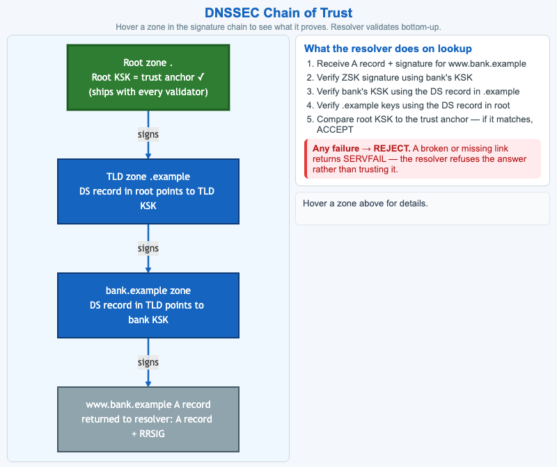

    A Mermaid tree of the DNSSEC chain of trust from the root zone trust anchor to a leaf A record, with the resolver's bottom-up validation steps.

-   **[GRC Relationship](./grc-relationship/index.md)**

    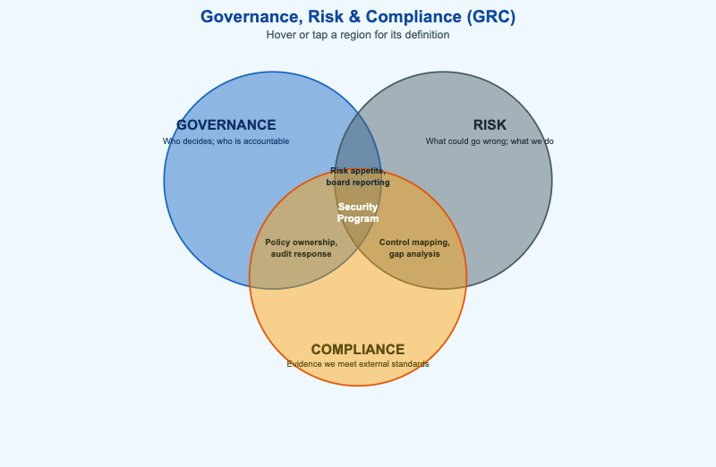

    Interactive three-circle Venn diagram of Governance, Risk, and Compliance, with hover tooltips on every region and overlap, including the central Security Program.

-   **[Hardening, Baselines, and Drift](./hardening-baselines-loop/index.md)**

    

    A Mermaid causal-loop diagram of the configuration-hardening feedback cycle among baselines, configuration management, and drift detection.

-   **[Hardware Trust Anchors on a Modern System](./trust-anchors-overview/index.md)**

    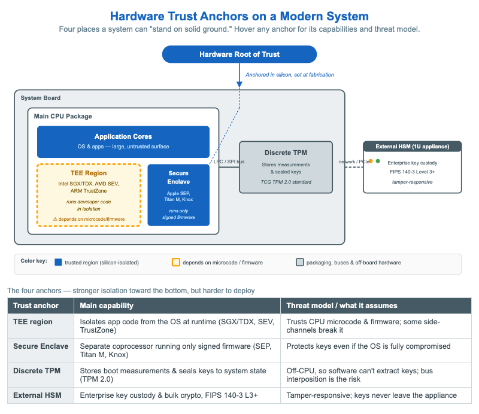

    An interactive SVG board diagram of four hardware trust anchors — TEE, Secure Enclave, TPM, and HSM — with a Hardware Root of Trust badge and hover tooltips giving each anchor's capability and threat model.

-   **[Hypervisor Architecture and the Trust Boundary](./hypervisor-architecture/index.md)**

    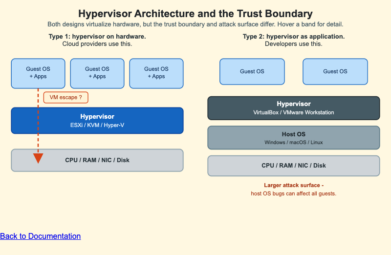

    Two side-by-side stacks contrast a Type 1 bare-metal hypervisor with a Type 2 hosted hypervisor, showing where the trust boundary sits, the VM-escape threat, and why the added host OS layer enlarges the attack surface.

-   **[IAM Request Flow](./iam-request-flow/index.md)**

    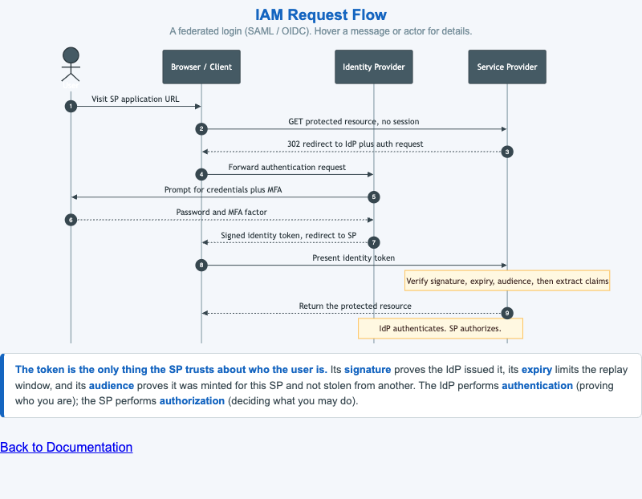

    A Mermaid sequence diagram of a federated login (SAML / OIDC) across four lanes — User, Browser, Identity Provider, and Service Provider — showing how the IdP authenticates and the SP authorizes via a signed identity token.

-   **[ICS Attack Path Explorer](./ics-attack-path-explorer/index.md)**

    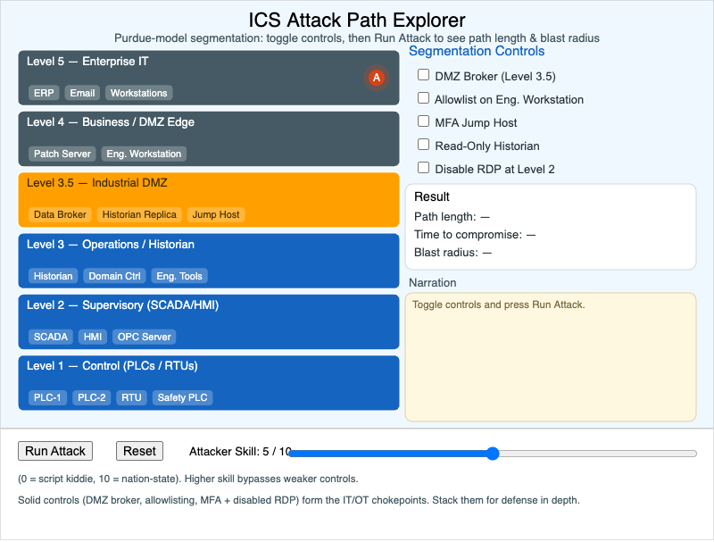

    Interactive p5.js MicroSim of a Purdue-model industrial network. Toggle segmentation controls and run an attack from Level 5 to the Level 1 PLCs to see how path length, time to compromise, and blast radius change.

-   **[IDS/IPS Decision Flow](./ids-ips-decision-flow/index.md)**

    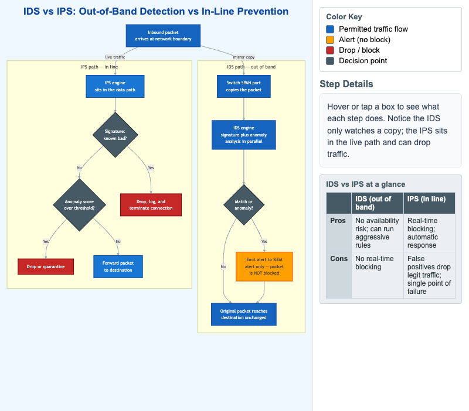

    Interactive Mermaid flowchart contrasting an out-of-band Intrusion Detection System with an in-line Intrusion Prevention System, with a pros and cons comparison panel.

-   **[IoT Device Security Stack](./iot-security-stack/index.md)**

    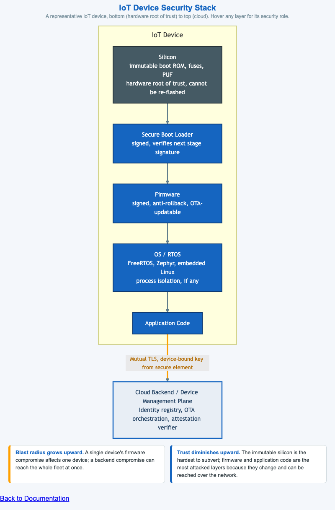

    A Mermaid flowchart of a representative IoT device drawn from the immutable silicon root of trust up through boot loader, firmware, OS, and application code, with a mutual-TLS channel to the cloud management plane.

-   **[Kernel / User Mode Boundary](./kernel-user-boundary/index.md)**

    

    Interactive SVG stack diagram of the user-mode (ring 3) / kernel-mode (ring 0) boundary, showing applications, the system-call interface, kernel subsystems, and hardware. Hover any layer for an explanation of why the privilege boundary matters.

-   **[Layered Network Defense Reference](./layered-network-defense-reference/index.md)**

    

    Interactive Mermaid layered architecture diagram showing defense in depth from the untrusted Internet down to internal datastores, with each layer labeled by the attack class it addresses.

-   **[Layers of Access Control on a Modern Linux Box](./linux-ac-layers/index.md)**

    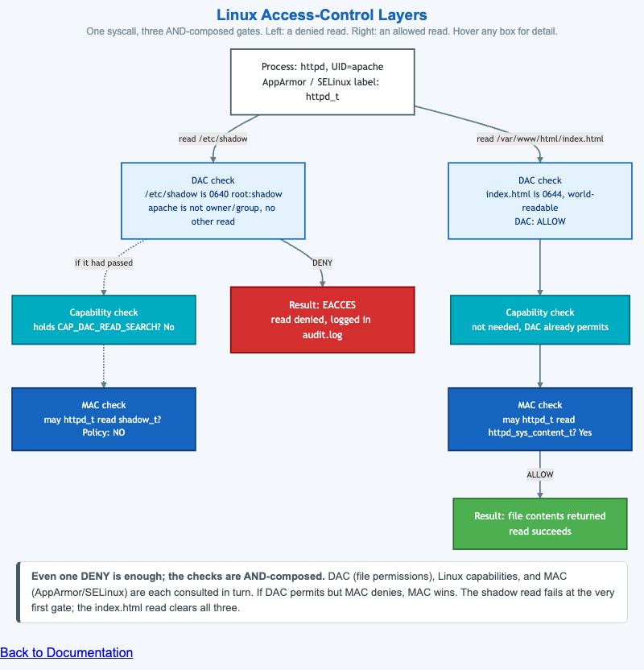

    A Mermaid flowchart following one read() syscall through three AND-composed Linux access-control gates — DAC, capabilities, and MAC — showing a denied read of /etc/shadow beside an allowed read of a web file.

-   **[Learning Graph Viewer](./graph-viewer/index.md)**

    

    Interactive learning graph viewer allows users to see all the concepts in the course and how they are related.  Used by AI to recommend personalized learning paths.

-   **[MITM via ARP Spoofing](./mitm-arp-spoofing/index.md)**

    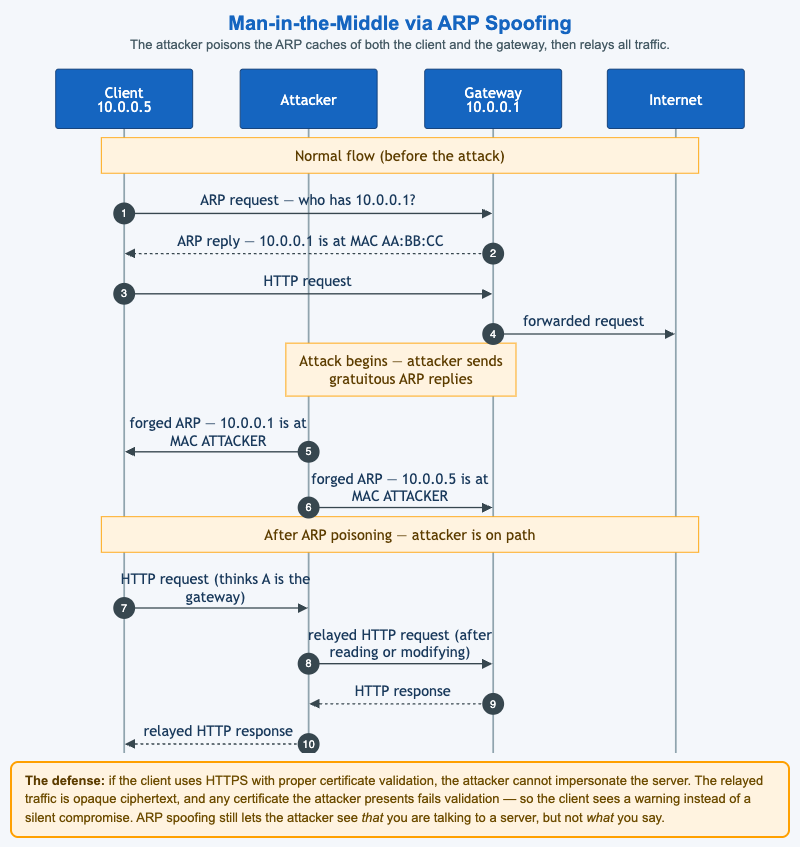

    Mermaid sequence diagram of a man-in-the-middle attack via ARP cache poisoning, contrasting the normal flow, the attacker's forged ARP replies, the relayed flow, and the HTTPS defense.

-   **[MITRE ATT&CK Tactic Sequence Explorer](./attack-tactic-sequence/index.md)**

    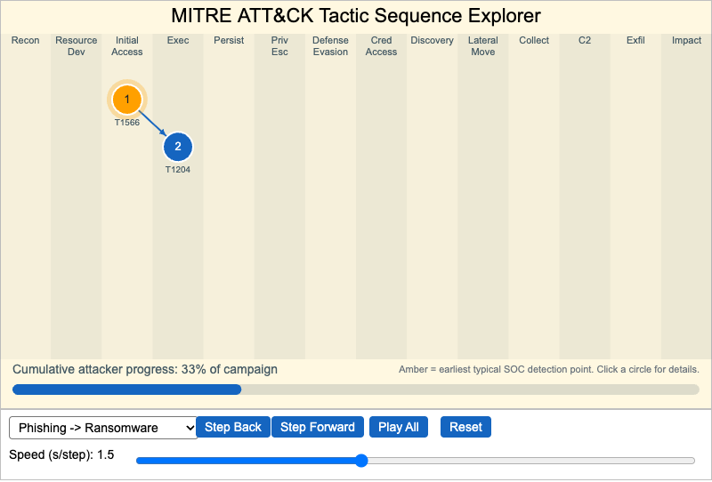

    Step through preset attack campaigns and watch each technique appear in the column of its MITRE ATT&CK tactic, analyzing how techniques chain into a full campaign and where a SOC could first detect it.

-   **[ML Attack Surface](./ml-attack-surface/index.md)**

    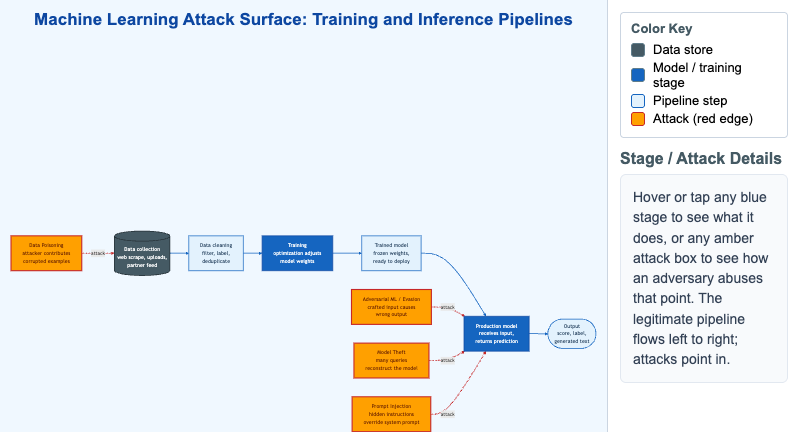

    Interactive Mermaid diagram of the machine-learning training and inference pipelines with four attack vectors pointing in - data poisoning, adversarial evasion, model theft, and prompt injection.

-   **[Network Security as Layered Defense](./network-defense-layers/index.md)**

    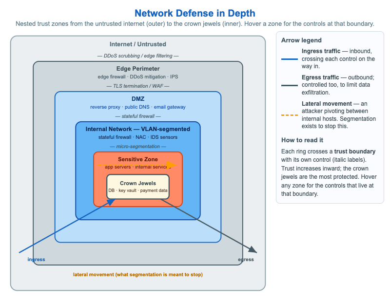

    A static SVG of six nested network trust zones from the untrusted internet to the crown jewels, with the control crossing each trust boundary and an arrow legend distinguishing ingress, egress, and lateral movement.

-   **[Network Telemetry Stack](./network-telemetry-stack/index.md)**

    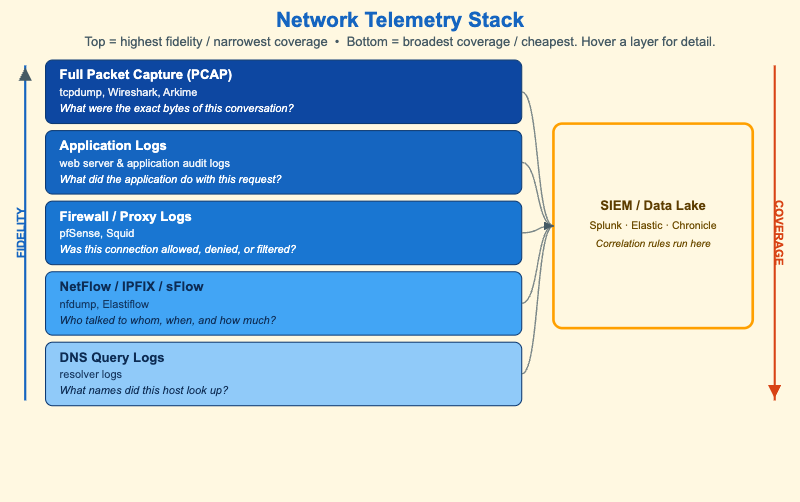

    Layered SVG diagram of five network telemetry sources ordered by fidelity and coverage, all feeding a SIEM / data lake, with a storage-cost trade-off note and per-layer hover tooltips.

-   **[NIST CSF 2.0 Functions](./nist-csf-functions/index.md)**

    

    Interactive SVG wheel of the six NIST Cybersecurity Framework 2.0 functions - GOVERN at the hub overseeing IDENTIFY, PROTECT, DETECT, RESPOND, and RECOVER - with hover tooltips.

-   **[OSI vs. TCP/IP Models](./osi-vs-tcpip/index.md)**

    

    Interactive SVG comparison of the 7-layer OSI model and the 4-layer TCP/IP model, with dashed layer-mapping lines, per-layer hover tooltips, and a "where attacks live" annotation column.

-   **[Password Cracking Cost](./password-cracking-cost/index.md)**

    

    Interactive p5.js calculator showing how the choice of password hash, attacker hardware, and database size change the time and dollar cost to crack a stolen password database.

-   **[Phishing Email Anatomy](./phishing-email-anatomy/index.md)**

    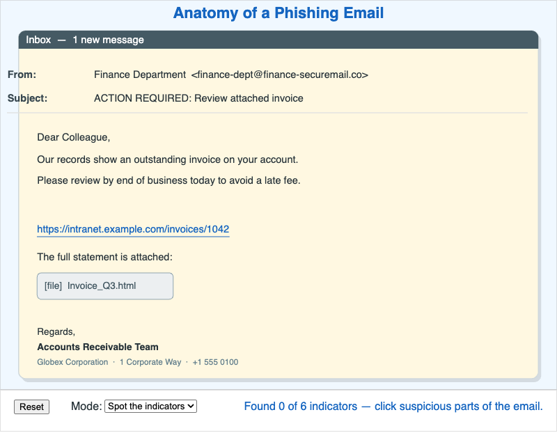

    An interactive p5.js infographic of a realistic spear-phishing email with six manipulation-technique hotspots, a Spot-the-indicators scoring mode, and an Annotated explanation mode.

-   **[PICERL Incident Response Lifecycle](./picerl-lifecycle/index.md)**

    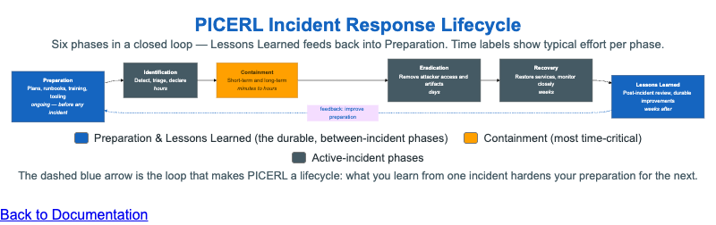

    Mermaid flowchart of the six PICERL incident-response phases as a closed loop, with a dashed feedback arrow from Lessons Learned back to Preparation and typical time labels per phase.

-   **[Practitioner Decision Flow](./practitioner-decision-flow/index.md)**

    

    Interactive Mermaid decision tree of the five gates a security practitioner clears before acting on a live system - Legal, Ethical, Forensic, Notification, and Public Good.

-   **[Privacy Engineering Decision Tree](./privacy-decision-tree/index.md)**

    

    A Mermaid decision tree an engineer or privacy reviewer walks for each proposed data field — need it, minimize it, retain how long, shared, lawful basis — mapping each branch to a GDPR/CCPA principle.

-   **[Privacy-Enhancing Technologies Compared](./privacy-tech-compare/index.md)**

    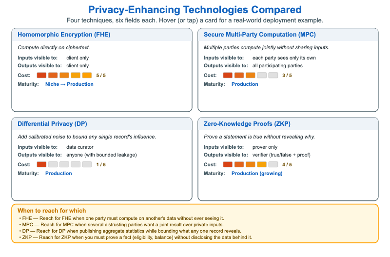

    Interactive SVG 2x2 comparison of four privacy-enhancing technologies (FHE, MPC, Differential Privacy, Zero-Knowledge Proofs) across definition, input/output visibility, computational cost, and maturity, with a real-world example tooltip per card.

-   **[Purdue Model Attack Paths](./purdue-model-attack-paths/index.md)**

    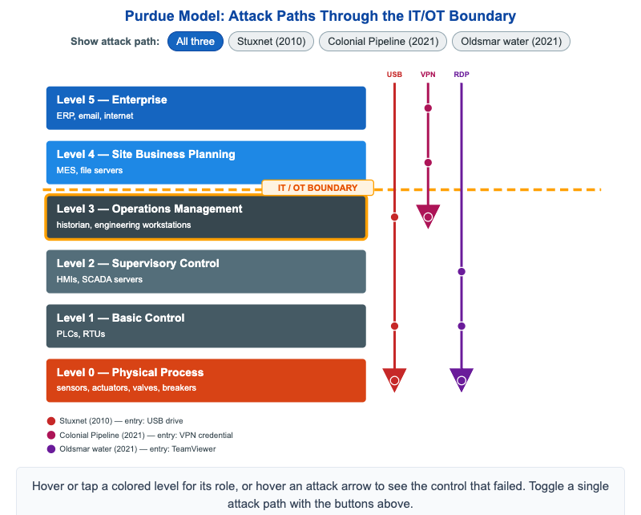

    Interactive SVG of the Purdue model levels with the IT/OT boundary highlighted and three historical ICS attack paths overlaid - Stuxnet, Colonial Pipeline, and Oldsmar - each annotated with the control that failed.

-   **[Pyramid of Pain](./pyramid-of-pain/index.md)**

    

    Interactive p5.js infographic of David Bianco's Pyramid of Pain. Hover each indicator level for an explanation, click for a sample SIEM detection rule, and toggle between Defender and Attacker views.

-   **[Risk Heat Map](./risk-heat-map/index.md)**

    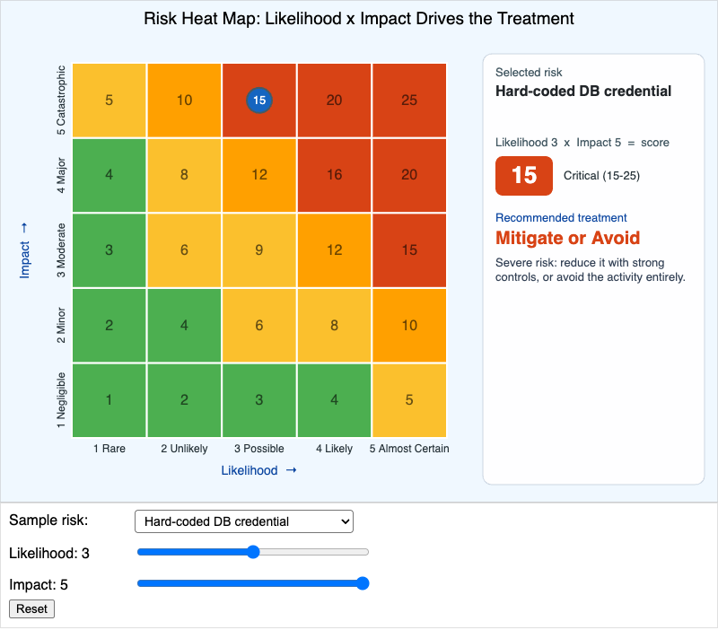

    Interactive p5.js 5x5 likelihood-by-impact risk heat map where the score and recommended treatment update as you place a risk by sample, slider, or drag.

-   **[Risk Treatment Decision Tree](./risk-treatment-decision-tree/index.md)**

    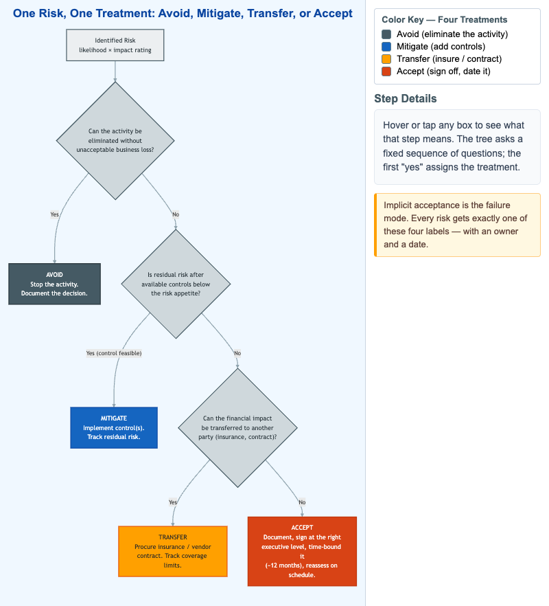

    Interactive Mermaid decision tree that routes a single identified risk through the four treatment options — avoid, mitigate, transfer, or accept — each with an owner and a date.

-   **[RTO and RPO Timeline](./rto-rpo-timeline/index.md)**

    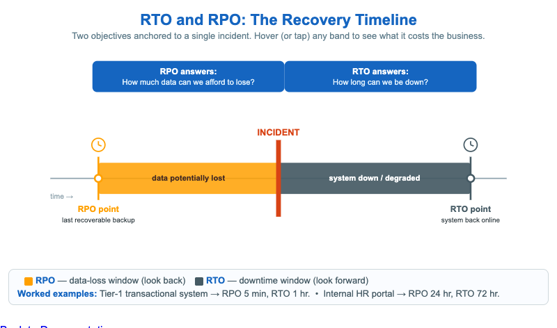

    An interactive SVG timeline that anchors RPO (the data-loss window before an incident) and RTO (the downtime window after it) to a single incident marker.

-   **[SBOM as a Dependency Tree Explorer](./sbom-dependency-explorer/index.md)**

    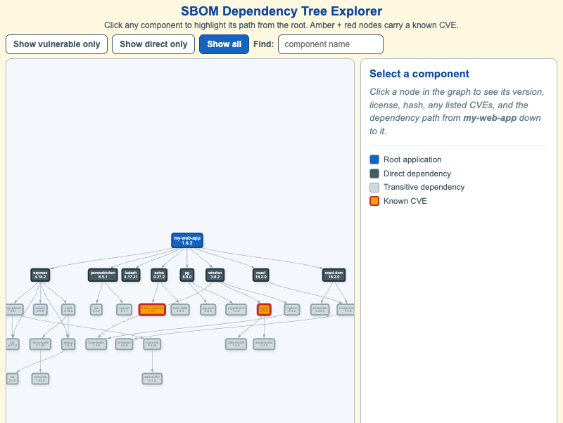

    Interactive vis-network graph of a realistic CycloneDX SBOM for a small web application. Click any component to highlight its path from the root, filter to vulnerable-only or direct-only dependencies, and inspect version, license, hash, and listed CVEs in a side panel.

-   **[Secure Boot vs. Measured Boot](./secure-vs-measured-boot/index.md)**

    

    A two-column Mermaid flowchart contrasting Secure Boot (enforce — verify and halt) with Measured Boot (record — hash and extend a TPM PCR), with hover details on each boot stage.

-   **[Security Control 3D Taxonomy](./control-taxonomy-cube/index.md)**

    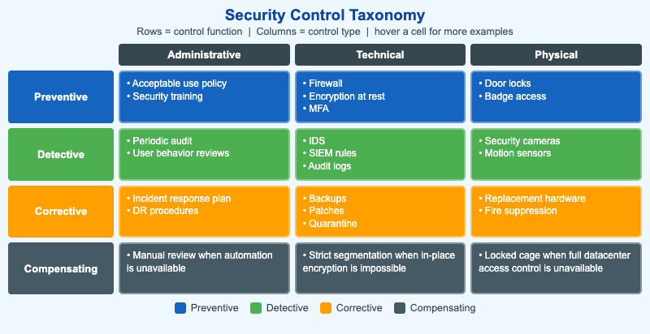

    Interactive grid classifying security controls by function (preventive, detective, corrective, compensating) and type (administrative, technical, physical), with hover-reveal examples.

-   **[Security Operations Activity Map](./secops-activity-map/index.md)**

    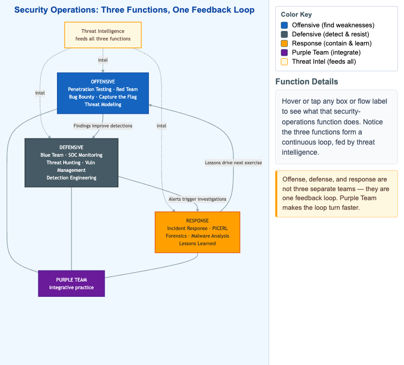

    Interactive Mermaid map of security operations as one feedback loop — offensive, defensive, and response functions fed by threat intelligence and integrated by a purple team.

-   **[Shared Responsibility Across IaaS, PaaS, and SaaS](./shared-responsibility-stack/index.md)**

    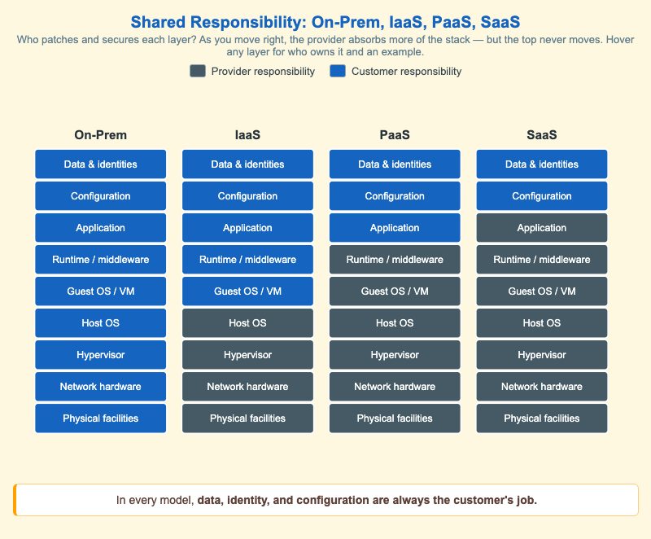

    Interactive SVG infographic comparing On-Prem, IaaS, PaaS, and SaaS as nine-layer stacks colored by who is responsible — showing that data, identity, and configuration always stay with the customer.

-   **[Side-Channel Attack Surface](./side-channel-overview/index.md)**

    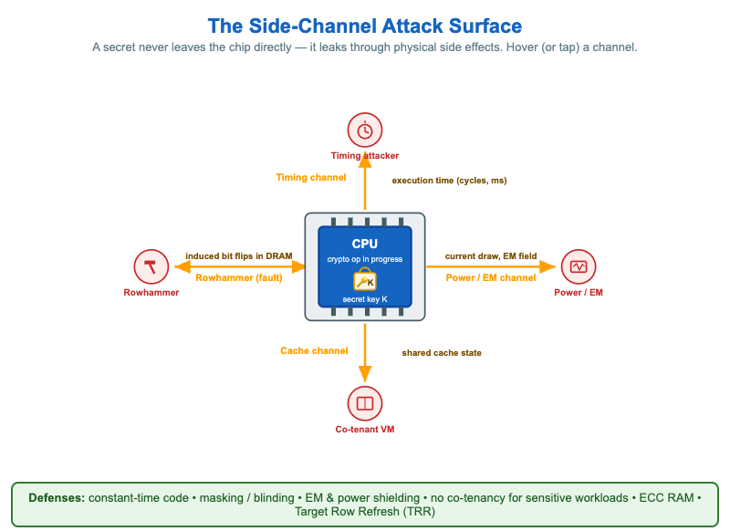

    An interactive SVG infographic of a CPU leaking its secret key through four physical side channels — timing, power/EM, cache, and rowhammer — with hover tooltips and a defenses badge.

-   **[Stack Frame With and Without a Canary Under Overflow](./stack-canary-comparison/index.md)**

    

    Interactive SVG comparison of two stack frames under a strcpy buffer overflow — one without a stack canary (exploit succeeds silently) and one with a canary (process aborts on the canary check). Hover the canary or saved return address for details.

-   **[Stack Layout During a Buffer Overflow](./stack-overflow-anatomy/index.md)**

    

    Interactive SVG infographic comparing a normal stack frame with an overflowed one — showing how writing past buffer[16] overwrites the saved frame pointer and return address, with hover tooltips naming the defenses that stop it.

-   **[Symmetric Encryption and Decryption Flow](./encryption-decryption-flow/index.md)**

    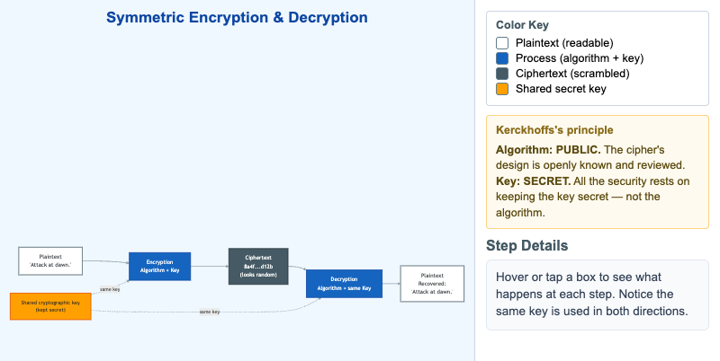

    Interactive Mermaid workflow of symmetric encryption showing plaintext encrypted to ciphertext and back, with one shared secret key in both directions, plus a Kerckhoffs's-principle callout.

-   **[The Forensic Investigation Workflow](./forensic-workflow/index.md)**

    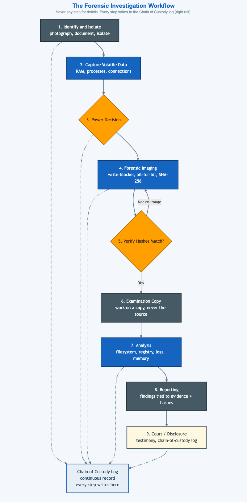

    A Mermaid flowchart of the digital forensic investigation process from identification through court disclosure, with a parallel chain-of-custody log.

-   **[The Operations Monitoring Pipeline](./ops-monitoring-pipeline/index.md)**

    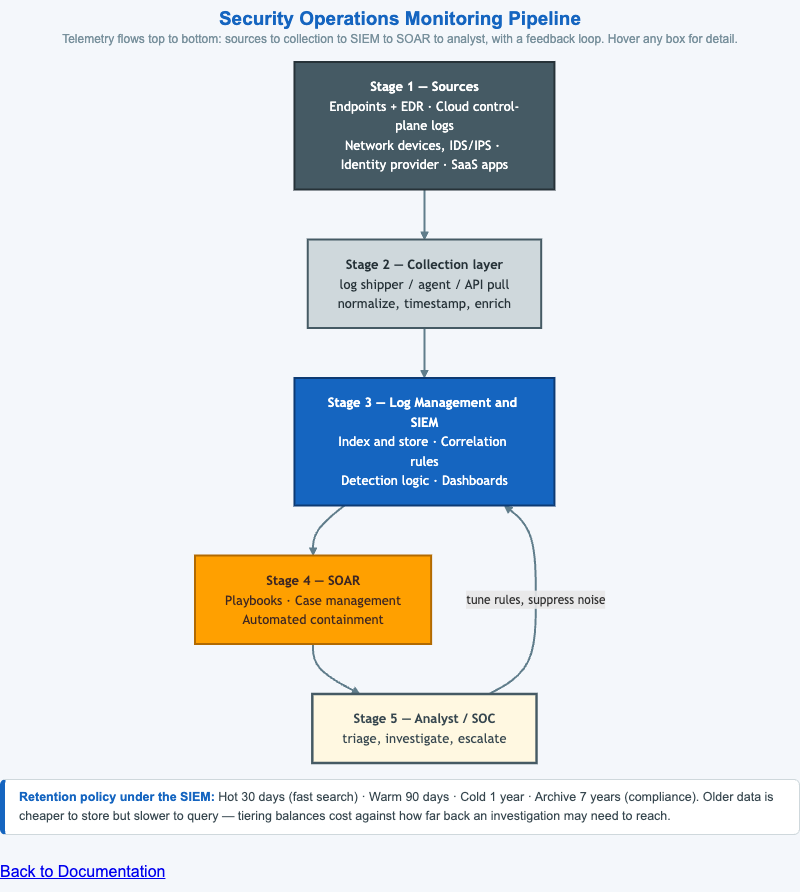

    A Mermaid pipeline diagram of a security operations data flow — telemetry sources to a collection layer to the SIEM to SOAR to the SOC analyst — with an analyst-to-SIEM feedback loop and a log-retention tiering note.

-   **[The Purdue Model — IT/OT Network Layers](./purdue-model-layers/index.md)**

    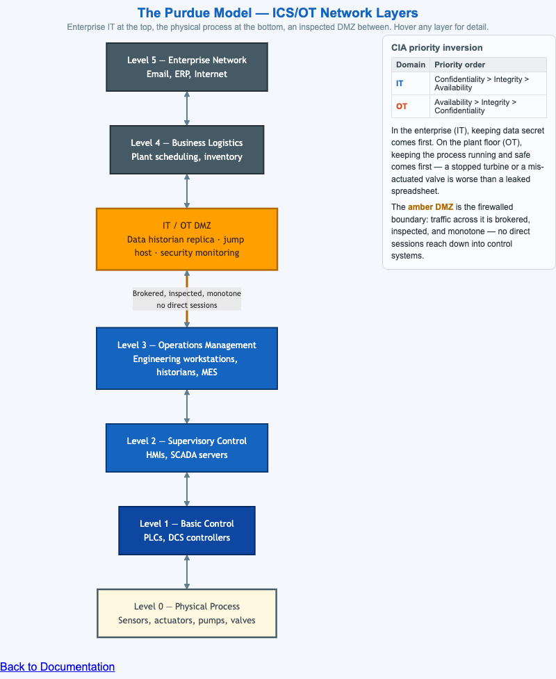

    A Mermaid diagram of the Purdue Enterprise Reference Architecture — seven stacked ICS/OT layers from the enterprise network down to the physical process, with the firewalled IT/OT DMZ and the IT-vs-OT CIA priority inversion.

-   **[The Security Program at a Glance](./security-program-layers/index.md)**

    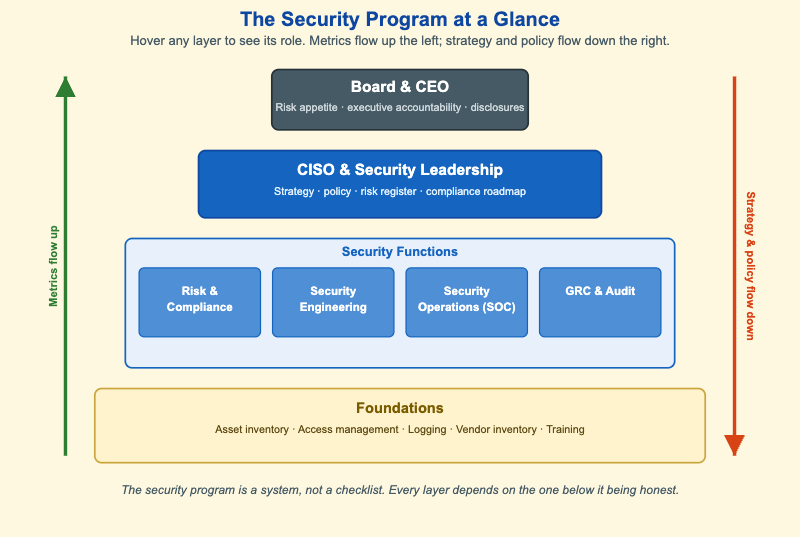

    Interactive four-layer SVG diagram of an organizational security program — Board & CEO, CISO & Security Leadership, the four Security Functions, and the Foundations. Hover any layer for its role; arrows show metrics flowing up and strategy flowing down.

-   **[The Three Layers of Software Assurance](./software-assurance-layers/index.md)**

    

    Interactive p5.js concentric-circle infographic of the three layers of software assurance — In-Code Defenses at the center, Analysis Tooling in the middle ring, and Supply Chain controls in the outer ring. Hover any chip for its definition; hover a ring for what that layer protects against.

-   **[Threat Actor Capability Matrix](./threat-actor-matrix/index.md)**

    

    Interactive SVG scatter plot placing five threat actor types on a Skill vs. Resources matrix, with circle size encoding typical campaign duration and hover tooltips for motivation, time horizon, and example incidents.

-   **[Threat Modeling Methodology Comparison](./threat-modeling-methods/index.md)**

    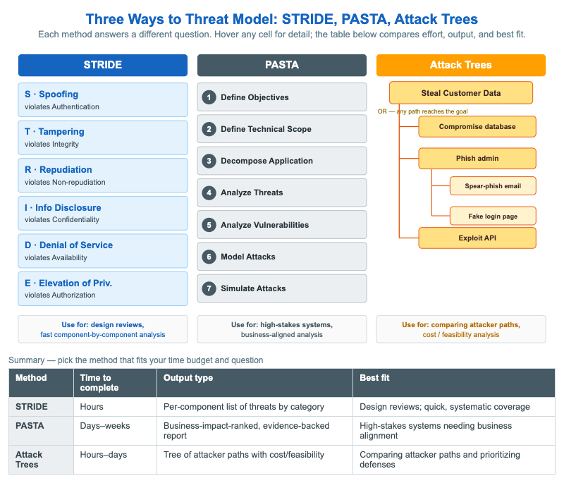

    A side-by-side infographic comparing STRIDE, PASTA, and Attack Trees with hover tooltips and a summary table of effort, output, and best fit.

-   **[Three Flavors of XSS](./xss-three-flavors/index.md)**

    

    A three-column SVG infographic comparing the data flow of stored, reflected, and DOM-based cross-site scripting, with hover tooltips on every step and color coding for legitimate flow, attacker-controlled data, and where the script executes.

-   **[TLS 1.3 Handshake](./tls13-handshake-sequence/index.md)**

    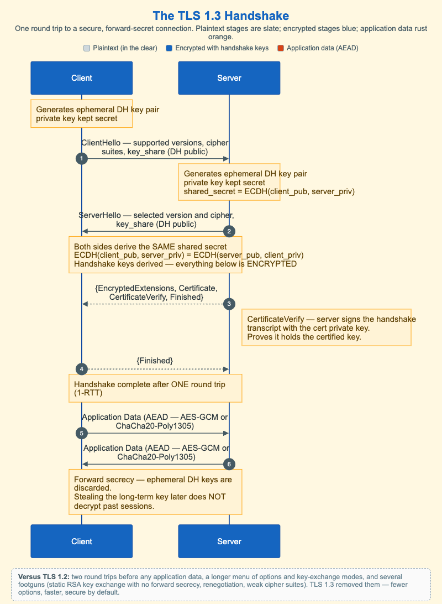

    A Mermaid sequence diagram of the 1-RTT TLS 1.3 handshake, with notes explaining ephemeral Diffie-Hellman, the encryption transition, CertificateVerify, and forward secrecy.

-   **[Vendor Risk Tiers](./vendor-risk-tiers/index.md)**

    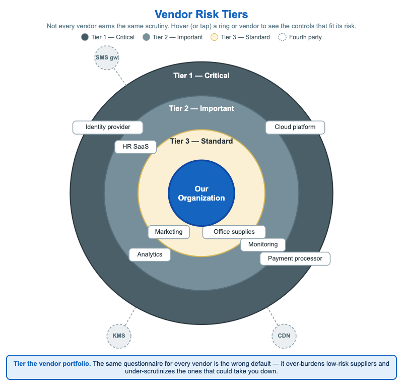

    An interactive concentric-ring infographic that tiers a vendor portfolio around the organization, with hover tooltips for the due-diligence controls that fit each tier and a fourth-party (subprocessor) cluster showing inherited risk.

-   **[Vulnerability Sandbox MicroSim](./vuln-sandbox/index.md)**

    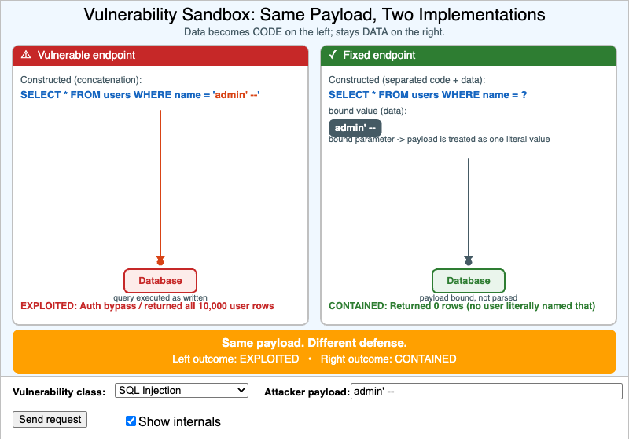

    Interactive p5.js sandbox that sends the same attacker payload to a vulnerable and a fixed implementation of the same web endpoint, side by side, so students can see why concatenating data into code is exploited while keeping the payload as data contains the attack.

