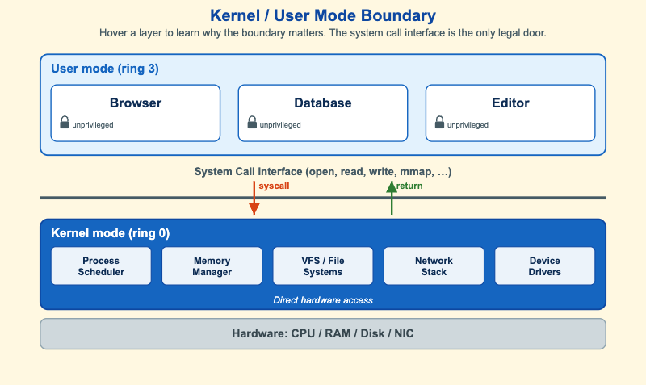

# Kernel / User Mode Boundary



<iframe src="main.html" width="100%" height="477" scrolling="no"></iframe>

[Run MicroSim in Fullscreen](main.html){ .md-button .md-button--primary }

You can include this MicroSim on your own page with the following `iframe`:

```html
<iframe src="https://dmccreary.github.io/cybersecurity/sims/kernel-user-boundary/main.html" height="477" width="100%" scrolling="no"></iframe>
```

## About this MicroSim

This diagram shows the single most important security boundary in an operating
system: the line between **user mode (ring 3)** and **kernel mode (ring 0)**. At the
top, three ordinary applications — a browser, a database, and an editor — run
unprivileged, each marked with a small lock. None of them can address the CPU, RAM,
disk, or network card directly.

The thick slate line in the middle is the **system call interface**. It is the
*only* legal way for user code to enter the kernel: a `syscall` traps down into
ring 0 and a `return` brings control back up. Below it sits the kernel itself —
process scheduler, memory manager, file systems, network stack, and device drivers
— which alone has direct hardware access. At the very bottom is the hardware the
kernel mediates.

Hover (or tap on a touch screen) any layer to reveal why the boundary matters. The
key insight the tooltips reinforce: a bug in a user application is *contained* by
ring 3, but a bug in the kernel is total compromise — there is no higher authority
to stop it. That asymmetry is why operating systems work so hard to keep the
attack surface of the syscall interface small and well validated.

## Lesson Plan

**Learning objective (Bloom: Understand).** Students will explain why user-mode
processes cannot touch hardware directly, identify the system call interface as the
only legal path between privilege rings, and reason about why a kernel bug is far
more dangerous than a user-process bug.

**Suggested classroom use.** Project the diagram and have students trace a single
file read — `open()` then `read()` — from the editor application, down through the
syscall boundary, into the VFS subsystem, and out to the disk. Ask them to name the
privilege transition at each crossing.

**Discussion questions:**

1. Why does the operating system force every hardware request through a small set of
   system calls instead of letting applications talk to devices directly?
2. A sandboxed browser tab is compromised. Why is that less catastrophic than a
   vulnerability in a device driver running in ring 0?
3. The syscall interface is the kernel's main attack surface. What does that imply
   about how carefully it must validate its arguments?

## References

- [Protection ring — Wikipedia](https://en.wikipedia.org/wiki/Protection_ring)
- [System call — Wikipedia](https://en.wikipedia.org/wiki/System_call)
- [User space and kernel space — Wikipedia](https://en.wikipedia.org/wiki/User_space_and_kernel_space)
- [Kernel (operating system) — Wikipedia](https://en.wikipedia.org/wiki/Kernel_(operating_system))

## Specification

The full specification below is extracted from
[Chapter 10: "System Security: OS, Memory, and Access Control"](../../chapters/10-system-security/index.md).

```text
Type: drawing
sim-id: kernel-user-boundary
Library: Static SVG with hover tooltips
Status: Specified

A horizontal stack diagram with three layers, top to bottom: a user-mode (ring 3,
light blue) layer with three unprivileged application boxes (Browser, Database,
Editor); a kernel-boundary line (slate steel) labeled "System Call Interface
(open, read, write, mmap, ...)" with a downward "syscall" arrow and an upward
"return" arrow; a kernel-mode (ring 0, cybersecurity blue) layer subdivided into
Process Scheduler, Memory Manager, VFS / File Systems, Network Stack, and Device
Drivers, labeled "Direct hardware access"; and a thinner gray hardware layer
labeled "CPU / RAM / Disk / NIC".

Hover tooltips per layer explain that user apps cannot touch hardware directly, the
system call interface is the only legal way into kernel mode, and a kernel bug is a
total compromise.

Color: cybersecurity blue (kernel), slate steel (boundary), light blue (user mode),
gray (hardware). Responsive: the SVG scales to its container.
```

## Related Resources

- [Chapter 10: "System Security: OS, Memory, and Access Control"](../../chapters/10-system-security/index.md)
