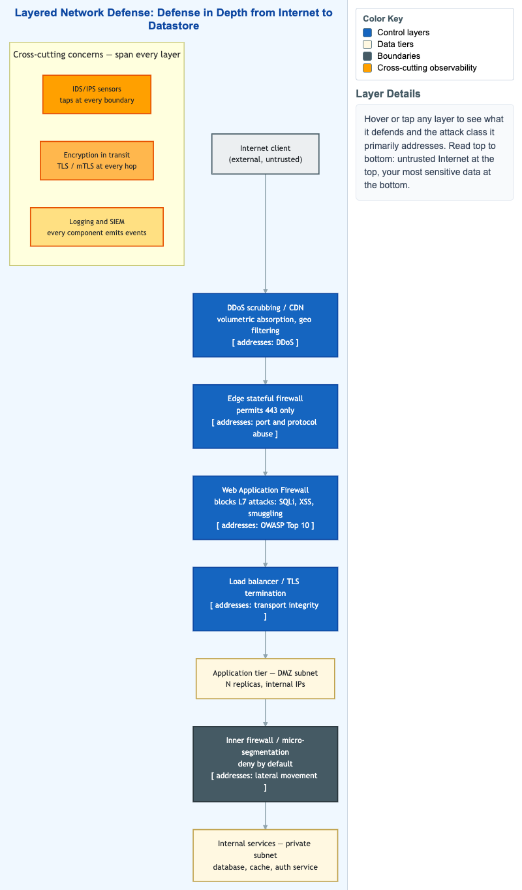

# Layered Network Defense Reference



<iframe src="main.html" width="100%" height="1362" scrolling="no"></iframe>

[Run MicroSim in Fullscreen](main.html){ .md-button .md-button--primary }

You can include this MicroSim on your own page with the following `iframe`:

```html
<iframe src="https://dmccreary.github.io/cybersecurity/sims/layered-network-defense-reference/main.html" height="1362" width="100%" scrolling="no"></iframe>
```

## About this MicroSim

This reference diagram reads top to bottom, from the untrusted **Internet
client** down to the **internal services** you most want to protect. Each
intervening layer — DDoS scrubbing / CDN, edge stateful firewall, Web
Application Firewall, load balancer / TLS termination, application tier, inner
firewall / micro-segmentation — is labeled with the **attack class it primarily
addresses** (DDoS, port abuse, the OWASP Top 10, lateral movement, and so on).
This is defense in depth made concrete: no single control is trusted to stop
everything, and a breach of one layer still meets another.

To the side, a **cross-cutting concerns** group shows the three controls that do
not live at any single layer but span all of them: **IDS/IPS sensors** tapping
every boundary, **encryption in transit** (TLS/mTLS) at every hop, and
**logging and SIEM** with every component emitting events. Hover over (or tap)
any box to read what that layer defends and why. The color key separates blue
control layers, cream data tiers, slate boundaries, and amber cross-cutting
observability. The layout reflows to a single column on narrow screens.

## Lesson Plan

**Learning objective (Bloom: Understand).** Students will describe the ordered
layers of a defense-in-depth network architecture, match each layer to the
attack class it addresses, and explain why monitoring, encryption, and logging
span every layer rather than sitting at one.

**Suggested classroom use.** Project the diagram and walk a request from the
Internet down to the database, naming what each layer checks. Then pose a "what
if this layer fails?" question at each level and have students identify which
downstream control still applies — the essence of defense in depth.

**Discussion questions:**

1. If an attacker bypasses the WAF, which later layers can still contain the
   damage, and which attack does the inner firewall specifically address?
2. Why are IDS/IPS, encryption in transit, and logging drawn as cross-cutting
   concerns instead of as additional stacked layers?
3. The internal services tier has no direct Internet path. What does an attacker
   have to compromise first to reach it, and how does micro-segmentation raise
   that cost?

## References

- [Defense in depth (computing) — Wikipedia](https://en.wikipedia.org/wiki/Defense_in_depth_(computing))
- [DMZ (computing) — Wikipedia](https://en.wikipedia.org/wiki/DMZ_(computing))
- [Web application firewall — Wikipedia](https://en.wikipedia.org/wiki/Web_application_firewall)
- [Network segmentation — Wikipedia](https://en.wikipedia.org/wiki/Network_segmentation)

## Specification

The full specification below is extracted from
[Chapter 8: "Network Security Foundations: Protocols, Firewalls, and Detection"](../../chapters/08-network-foundations/index.md).

```text
Type: diagram
sim-id: layered-network-defense-reference
Library: Mermaid
Status: Specified

A vertical layered architecture diagram (top to bottom):
1. Internet client (external)
2. DDoS scrubbing / CDN layer (volumetric absorption, geo filtering)
3. Edge stateful firewall (permits 443 only)
4. WAF (blocks L7 attacks: SQLi, XSS, request smuggling)
5. Load balancer / TLS termination
6. Application tier (DMZ/public subnet) — N replicas, internal IPs
7. Inner firewall / micro-segmentation — deny by default
8. Internal services tier (private subnet) — database, cache, auth service

To the right, three cross-cutting concerns: IDS/IPS sensors, encryption in
transit, logging and SIEM. For each layer, a badge shows the attack class it
primarily addresses (DDoS, OWASP Top 10, lateral movement, etc.).

Color: cybersecurity blue for control layers, cream for data tiers, slate for
boundaries, amber accent for cross-cutting observability. Responsive: stacks
vertically below 900px.

Implementation: Mermaid flowchart TD with subgraphs for each layer; cross-cutting
annotations as a separate subgraph along the right margin.
```

## Related Resources

- [Chapter 8: "Network Security Foundations: Protocols, Firewalls, and Detection"](../../chapters/08-network-foundations/index.md)
