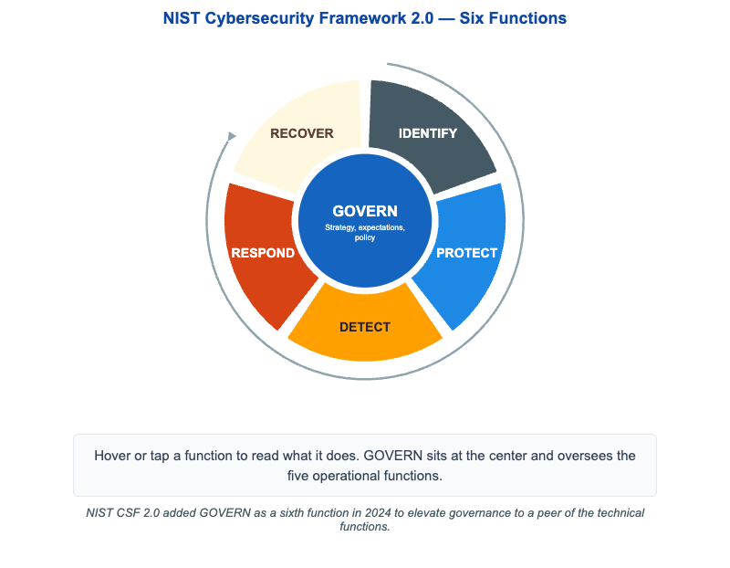

# NIST CSF 2.0 Functions



<iframe src="main.html" width="100%" height="622" scrolling="no"></iframe>

[Run MicroSim in Fullscreen](main.html){ .md-button .md-button--primary }

You can include this MicroSim on your own page with the following `iframe`:

```html
<iframe src="https://dmccreary.github.io/cybersecurity/sims/nist-csf-functions/main.html" height="622" width="100%" scrolling="no"></iframe>
```

## About this MicroSim

This wheel shows the six functions of the **NIST Cybersecurity Framework (CSF)
2.0**. At the center sits **GOVERN** — the strategy, expectations, and policy
that oversee everything else. Around it, a colored ring holds the five
operational functions: **IDENTIFY** (know your assets and risks), **PROTECT**
(put safeguards in place), **DETECT** (monitor for anomalies), **RESPOND**
(contain and analyze incidents), and **RECOVER** (restore and learn). A thin
clockwise arrow on the outside traces the cycle Identify → Protect → Detect →
Respond → Recover and back, because cybersecurity is a continuous loop rather
than a one-time checklist.

Hover over (or tap, on a touch screen) any segment or the GOVERN hub to read a
one-sentence description of what that function actually does. On narrow screens
the wheel re-renders as a numbered vertical list so it stays readable on a
phone. The single most important update to remember: **GOVERN is new in CSF
2.0** — NIST added it in 2024 to make governance a peer of the technical
functions rather than an afterthought.

## Lesson Plan

**Learning objective (Bloom: Understand).** Students will name the six NIST CSF
2.0 functions, describe the role of each, and explain why GOVERN was elevated to
a sixth function overseeing the operational cycle.

**Suggested classroom use.** Project the wheel and ask students to assign
everyday security activities — patching, log review, tabletop exercises,
backups, an asset inventory — to the correct function. Then discuss how GOVERN
shapes the priorities of all five.

**Discussion questions:**

1. Why is the framework drawn as a cycle rather than a sequence with an end?
   What feeds RECOVER back into IDENTIFY?
2. GOVERN does not perform technical work directly. What does it provide that
   makes the other five functions effective, and what fails if it is missing?
3. A team is strong at DETECT but weak at RESPOND. What is the practical
   consequence, and which function should they invest in next?

## References

- [NIST Cybersecurity Framework — Wikipedia](https://en.wikipedia.org/wiki/NIST_Cybersecurity_Framework)
- [NIST CSF 2.0 (official)](https://www.nist.gov/cyberframework)
- [NIST CSF 2.0 Reference Tool](https://csrc.nist.gov/Projects/cybersecurity-framework/Filters)

## Specification

The full specification below is extracted from
[Chapter 13: "Organizational Security"](../../chapters/13-organizational-security/index.md).

```text
Type: infographic-svg
sim-id: nist-csf-functions
Library: Static SVG with hover tooltips
Status: Specified

A wheel diagram on a 900x600 canvas:
- Center hub: GOVERN (cybersecurity blue, white text). Subtitle: "Strategy, expectations, policy."
- Five spokes radiating outward, each a colored arc segment forming a ring:
  - IDENTIFY (slate steel) — "Assets, risks, roles."
  - PROTECT (cybersecurity blue, lighter shade) — "Safeguards, training, access control."
  - DETECT (amber) — "Monitoring, anomalies, IDS."
  - RESPOND (rust orange) — "Containment, communications, analysis."
  - RECOVER (cream, dark text) — "Restore, lessons learned, plans."
- A thin clockwise arrow on the outside suggests the cycle Identify -> Protect ->
  Detect -> Respond -> Recover -> (back), with Govern overseeing all five.

Each segment has a hover tooltip with a one-sentence description.
Caption: "NIST CSF 2.0 added GOVERN as a sixth function in 2024..."
Responsive: scales to container width; below 600px becomes a vertical numbered list.

Implementation: Inline SVG with hover tooltips and a small resize handler.
```

## Related Resources

- [Chapter 13: "Organizational Security"](../../chapters/13-organizational-security/index.md)
