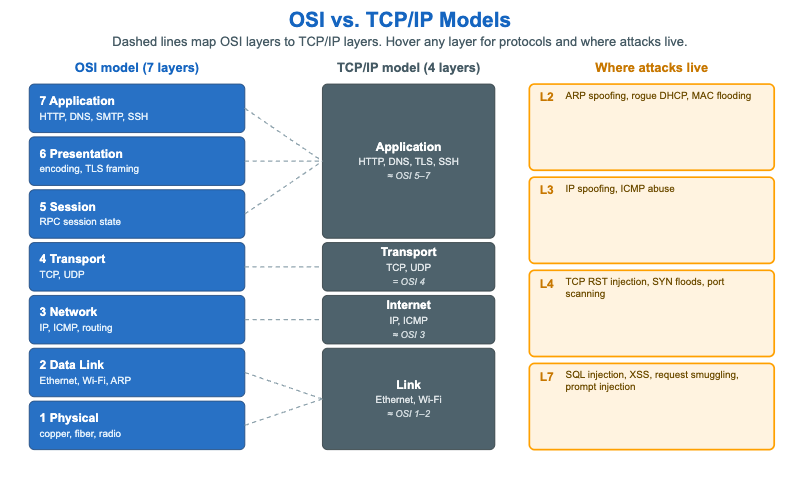

# OSI vs. TCP/IP Models



<iframe src="main.html" width="100%" height="502" scrolling="no"></iframe>

[Run MicroSim in Fullscreen](main.html){ .md-button .md-button--primary }

You can include this MicroSim on your own page with the following `iframe`:

```html
<iframe src="https://dmccreary.github.io/cybersecurity/sims/osi-vs-tcpip/main.html" height="502" width="100%" scrolling="no"></iframe>
```

## About this MicroSim

This side-by-side compares the two network models every practitioner switches
between. The left column is the **7-layer OSI model**, drawn with Application at the
top and Physical at the bottom; the center column is the **4-layer TCP/IP model**
that real networks actually run. Dashed lines connect each OSI layer to the TCP/IP
layer that absorbs it — most visibly, TCP/IP's single **Application** layer spans OSI
layers 5, 6, and 7, and its **Link** layer spans OSI layers 1 and 2.

Each layer in both columns lists example protocols (HTTP and DNS at the top; IP and
ICMP in the middle; Ethernet and Wi-Fi at the bottom). Hover or tap any layer for a
tooltip naming the protocols and one example security control that operates there —
for instance, stateful firewalls at the Transport layer and dynamic ARP inspection
at the Link layer.

The far-right column anchors the models to security practice: it shows **where
attacks live**. ARP spoofing and rogue DHCP are L2 problems; IP spoofing and ICMP
abuse are L3; SYN floods and port scanning are L4; and SQL injection, XSS, and
prompt injection are L7. Mapping an attack to its layer is the first step toward
choosing a control that can actually see and stop it.

## Lesson Plan

**Learning objective (Bloom: Understand).** Students will map each OSI layer to its
TCP/IP counterpart, identify example protocols at each layer, and associate common
attacks with the layer they target.

**Suggested classroom use.** Call out a protocol or an attack ("SYN flood",
"Ethernet", "SQL injection") and have students point to the correct layer in *both*
models and name the matching defensive control from the tooltip.

**Discussion questions:**

1. Why does the TCP/IP model collapse OSI layers 5, 6, and 7 into a single
   application layer? What does that say about how those layers behave in practice?
2. TLS is sometimes described as layer 6 and sometimes as part of the application
   layer. Why is its placement ambiguous, and does the ambiguity matter operationally?
3. Why does knowing an attack's layer help you pick a control? Give an example where
   a control at the wrong layer cannot see the attack.

## References

- [OSI model — Wikipedia](https://en.wikipedia.org/wiki/OSI_model)
- [Internet protocol suite — Wikipedia](https://en.wikipedia.org/wiki/Internet_protocol_suite)
- [Communication protocol — Wikipedia](https://en.wikipedia.org/wiki/Communication_protocol)
- [Network security — Wikipedia](https://en.wikipedia.org/wiki/Network_security)

## Specification

The full specification below is extracted from
[Chapter 8: "Network Security Foundations: Protocols, Firewalls, and Detection"](../../chapters/08-network-foundations/index.md).

```text
Type: infographic-svg
sim-id: osi-vs-tcpip
Library: Static SVG with hover tooltips
Status: Specified

A two-column visual. Left: the 7-layer OSI model (Physical, Data Link, Network,
Transport, Session, Presentation, Application). Right-center: the 4-layer TCP/IP
model (Link ≈ OSI 1+2, Internet ≈ OSI 3, Transport = OSI 4, Application ≈ OSI 5+6+7).
Dashed lines map OSI layers to TCP/IP layers, and each cell lists example protocols.

To the right, a "where attacks live" annotation: L2 (ARP spoofing, rogue DHCP, MAC
flooding), L3 (IP spoofing, ICMP abuse), L4 (TCP RST injection, SYN floods, port
scanning), L7 (SQL injection, XSS, request smuggling, prompt injection).

Per-layer hover tooltips show example protocols and an example control (e.g. L4:
"stateful firewalls operate here"). Color: cybersecurity blue OSI column, slate
TCP/IP column, amber attack callouts. Responsive: the SVG scales to its container.
```

## Related Resources

- [Chapter 8: "Network Security Foundations: Protocols, Firewalls, and Detection"](../../chapters/08-network-foundations/index.md)
