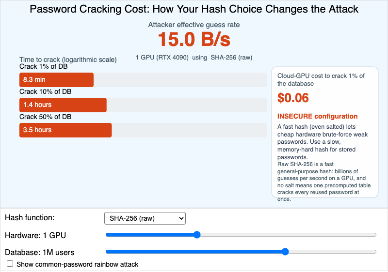

# Password Cracking Cost



<iframe src="main.html" width="100%" height="562" scrolling="no"></iframe>

[Run the Password Cracking Cost MicroSim Fullscreen](./main.html){ .md-button .md-button--primary }

You can include this MicroSim on your own page with the following `iframe`:

```html
<iframe src="https://dmccreary.github.io/cybersecurity/sims/password-cracking-cost/main.html" height="562" width="100%" scrolling="no"></iframe>
```

## About this MicroSim

This calculator puts you in the attacker's seat after a password database has
been stolen, and shows how much your defensive choices matter. Pick a **hash
function** (raw SHA-256, SHA-256 + salt, bcrypt at cost 10 or 12, or Argon2id),
slide the **attacker hardware** from a single CPU up to an ASIC cluster, and set
the **database size**. The large readout shows the attacker's effective
**guesses per second**, the bars show the time to crack 1%, 10%, and 50% of the
database on a logarithmic scale, and the right-hand panel estimates the
**cloud-GPU dollar cost** to crack 1% — plus a verdict on whether the
configuration is defensible.

The order-of-magnitude lesson is stark. Raw SHA-256 lets even modest hardware
make billions of guesses per second; turning on the **common-password rainbow
attack** with an unsalted hash cracks reused passwords almost instantly. Adding
a unique **salt** defeats the rainbow table but does nothing about raw speed.
Only a deliberately **slow** hash (bcrypt) or a **memory-hard** one (Argon2id,
which strips GPUs and ASICs of their parallelism) pushes the time and cost into
the prohibitive range. Move the controls and watch the cost swing across many
orders of magnitude — that swing is the whole argument for slow password
hashing. The numbers are hard-coded teaching figures calibrated against
published 2025 GPU benchmarks, not a precise cracking simulator.

## Lesson Plan

**Learning objective (Bloom: Analyze).** Students will analyze how each
password-protection technique (no protection, salt, slow hash, memory-hard hash)
changes the time and dollar cost an attacker faces when cracking a stolen
database of passwords.

**Suggested classroom use.** Have students hold hardware and database size fixed
and step through the five hash functions, recording the cost to crack 1% at each
step. Then have them fix the hash at raw SHA-256 and step up the hardware to see
how cheaply an attacker scales. Close with the rainbow-attack checkbox to make
the salt lesson concrete.

**Discussion questions:**

1. With raw SHA-256 + salt, why is the cost still low even though the rainbow
   table no longer works? What property of SHA-256 is the problem?
2. Argon2id barely slows down on the ASIC cluster compared to bcrypt. What is it
   about memory-hardness that neutralizes specialized hardware?
3. You must store 10M passwords and want the cheapest configuration an attacker
   still cannot mass-crack. Which option do you choose, and what assumption are
   you making about future hardware?

## References

- [Key derivation function — Wikipedia](https://en.wikipedia.org/wiki/Key_derivation_function)
- [bcrypt — Wikipedia](https://en.wikipedia.org/wiki/Bcrypt)
- [Argon2 — Wikipedia](https://en.wikipedia.org/wiki/Argon2)
- [Rainbow table — Wikipedia](https://en.wikipedia.org/wiki/Rainbow_table)
- [OWASP Password Storage Cheat Sheet](https://cheatsheetseries.owasp.org/cheatsheets/Password_Storage_Cheat_Sheet.html)

## Specification

The full specification below is extracted from
[Chapter 4: "Cryptography in Practice"](../../chapters/04-crypto-in-practice/index.md).

```text
Type: microsim
sim-id: password-cracking-cost
Library: p5.js
Status: Specified

Learning objective (Bloom: Analyze): Students will analyze how each
password-protection technique (no protection, salt, slow hash, memory-hard hash)
changes the time and dollar cost an attacker faces when cracking a stolen
database of 1 million passwords.

Controls: Dropdown (hash function), slider (attacker hardware), slider (database
size), checkbox (common-password rainbow attack).

Visual elements: animated bar showing passwords cracked per second (large
numerical readout); time-to-crack 1%, 10%, 50% as labeled lines; a dollar cost
estimator for cloud GPUs; safe/unsafe color coding; a footgun callout in red for
genuinely insecure configurations; per-hash tooltip explaining its speed.

Implementation: p5.js with hard-coded benchmark numbers calibrated against
published 2025 GPU benchmarks.
```

## Related Resources

- [Chapter 4: "Cryptography in Practice"](../../chapters/04-crypto-in-practice/index.md)
