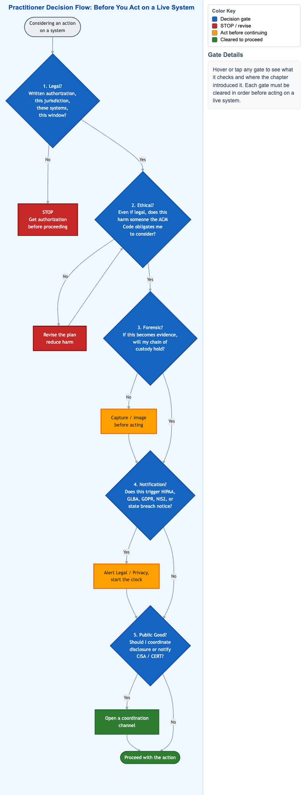

# Practitioner Decision Flow



<iframe src="main.html" width="100%" height="2082" scrolling="no"></iframe>

[Run MicroSim in Fullscreen](main.html){ .md-button .md-button--primary }

You can include this MicroSim on your own page with the following `iframe`:

```html
<iframe src="https://dmccreary.github.io/cybersecurity/sims/practitioner-decision-flow/main.html" height="2082" width="100%" scrolling="no"></iframe>
```

## About this MicroSim

This decision tree captures the habit that separates a professional from a
hobbyist: before you act on a live system, you pass through five gates in order.
**1. Legal?** — do you have written, scoped authorization in this jurisdiction,
for these systems, in this window? If not, STOP. **2. Ethical?** — even if it is
legal, does it harm someone the ACM Code obligates you to consider? If so, revise
the plan. **3. Forensic?** — if this becomes evidence, will your chain of custody
hold? If at risk, capture before acting. **4. Notification?** — does this trigger
HIPAA, GLBA, GDPR, NIS2, or a state breach notice? If so, alert Legal/Privacy and
start the clock. **5. Public Good?** — should you coordinate disclosure or notify
CISA/CERT? Only after all five gates clear are you cleared to proceed.

Hover over (or tap) any gate to read what it checks and where the chapter
introduced it. The color key separates blue decision gates, red STOP/revise
outcomes, amber "act before continuing" steps, and the green cleared-to-proceed
path. The key idea is that these gates are **independent and ordered**: passing
the legal gate says nothing about the ethical one, and acting before the forensic
gate can destroy evidence you cannot recover.

## Lesson Plan

**Learning objective (Bloom: Apply).** Students will apply the five-gate
checklist — Legal, Ethical, Forensic, Notification, Public Good — to decide
whether and how to act on a system, and explain why clearing one gate does not
clear the others.

**Suggested classroom use.** Give students a scenario (for example, discovering
an exposed database belonging to another company) and have them walk all five
gates aloud, naming what they would do at each. Then change one fact — remove the
authorization, or add protected health data — and have them re-run the flow.

**Discussion questions:**

1. You have written authorization to test a system and find personal data exposed
   to the internet. Which later gates does that discovery activate, and in what
   order do you act?
2. Why is the forensic gate placed before notification and disclosure? What is
   lost if you act first and preserve evidence second?
3. An action is legal and causes no individual harm, but disclosing the
   underlying flaw publicly would help many others. Which gate is in tension, and
   how would you resolve it responsibly?

## References

- [ACM Code of Ethics and Professional Conduct](https://www.acm.org/code-of-ethics)
- [Coordinated vulnerability disclosure — Wikipedia](https://en.wikipedia.org/wiki/Coordinated_vulnerability_disclosure)
- [Chain of custody — Wikipedia](https://en.wikipedia.org/wiki/Chain_of_custody)
- [Data breach notification laws — Wikipedia](https://en.wikipedia.org/wiki/Data_breach_notification_laws)

## Specification

The full specification below is extracted from
[Chapter 14: "Societal Security: Law, Ethics, and Privacy"](../../chapters/14-societal-security/index.md).

```text
Type: workflow-diagram
sim-id: practitioner-decision-flow
Library: Mermaid
Status: Specified

Mermaid flowchart TD with five sequential decision diamonds:
1. Legal? — written authorization in this jurisdiction, for these systems, this window? No: STOP. Yes: continue.
2. Ethical? — even if legal, does this harm someone the ACM Code obligates me to consider? No: revise. Yes: continue.
3. Forensic? — if this becomes evidence, will my chain of custody hold? No: capture before acting. Yes: continue.
4. Notification? — does this trigger HIPAA/GLBA/GDPR/NIS2/state breach notice? Yes: alert Legal/Privacy, start clock. Continue.
5. Public Good? — should I coordinate disclosure or notify CISA/CERT? Yes: open coordination channel.

Each diamond links to the section in the chapter where its concepts were introduced.

Implementation: Mermaid flowchart TD with class definitions for STOP (red),
CONTINUE (cybersecurity blue), and reference links.
```

## Related Resources

- [Chapter 14: "Societal Security: Law, Ethics, and Privacy"](../../chapters/14-societal-security/index.md)
