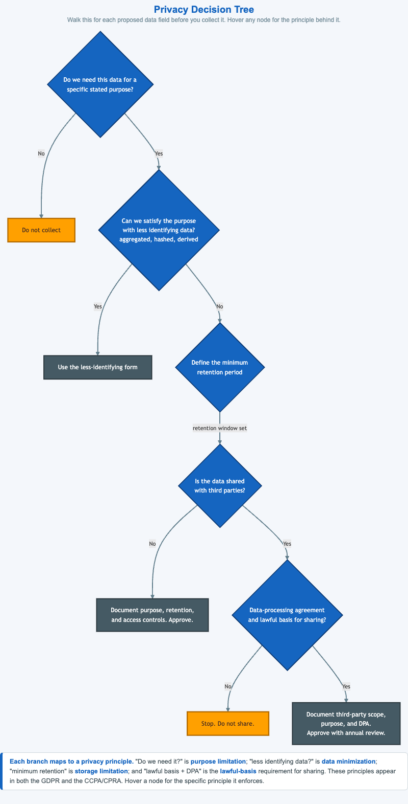

# Privacy Engineering Decision Tree



<iframe src="main.html" width="100%" height="1572" scrolling="no"></iframe>

[Run the Privacy Decision Tree MicroSim Fullscreen](main.html){ .md-button .md-button--primary }

You can include this MicroSim on your own website with the following `iframe`:

```html
<iframe src="https://dmccreary.github.io/cybersecurity/sims/privacy-decision-tree/main.html" height="1572" width="100%" scrolling="no"></iframe>
```

## About this MicroSim

This decision tree is the one an engineer or privacy reviewer should walk **for
each proposed data field, before it is ever collected**. It starts with the
hardest question — *do we need this data for a specific stated purpose?* If not,
the answer is the cleanest control there is: **do not collect it.** If you do
need it, the tree pushes you toward the **least identifying form** that still
works (aggregated, hashed, or derived), then forces you to set a **minimum
retention period**, asks whether the data is **shared with third parties**, and —
if it is — requires both a **data-processing agreement** and a **lawful basis**
before approving the share.

The power of the tree is that every branch corresponds to a named privacy
principle that appears in both the GDPR and the California CCPA/CPRA:
**purpose limitation**, **data minimization**, **storage limitation**, and
**lawful basis**. The two amber leaves ("Do not collect" and "Stop. Do not
share.") are the stop conditions; the slate leaves are the approve/use outcomes.
Hover any node to see the specific principle it enforces. The lesson is that good
privacy is a series of small "no by default" decisions, not a single policy
document.

## Lesson Plan

**Learning objective (Bloom — Apply):** Students can apply a structured decision
process to decide whether and how to collect a proposed data field, and map each
branch to the GDPR/CCPA principle it enforces.

**Suggested classroom use:** Give each group a concrete field — a customer's date
of birth, a precise GPS location, a device identifier — and have them walk the
tree to a leaf, hovering each decision to name the principle. Compare where
different fields land and why.

**Discussion questions:**

1. A field is genuinely useful but not strictly *needed* for the stated purpose.
   Where does the tree send it, and which principle is that?
2. Why does the tree prefer a hashed or aggregated form over the raw value even
   when collection is justified?
3. Sharing requires *both* a DPA and a lawful basis. Why is either one alone
   insufficient?

## References

- [Data minimization (Wikipedia)](https://en.wikipedia.org/wiki/Data_minimization)
- [General Data Protection Regulation (Wikipedia)](https://en.wikipedia.org/wiki/General_Data_Protection_Regulation)
- [California Consumer Privacy Act (Wikipedia)](https://en.wikipedia.org/wiki/California_Consumer_Privacy_Act)

## Specification

The full specification below is extracted from
[Chapter 12: "Human Security: Identity, Authentication, and Social Engineering"](../../chapters/12-human-security/index.md).

```text
Type: workflow-diagram
**sim-id:** privacy-decision-tree<br/>
**Library:** Mermaid<br/>
**Status:** Specified

A top-down decision tree that an engineer or privacy reviewer walks through for each proposed data field.

Root: "Do we need this data for a specific stated purpose?"

- No → "Do not collect."
- Yes → "Can we satisfy the purpose with less identifying data (aggregated, hashed, derived)?"
  - Yes → "Use the less-identifying form."
  - No → "What is the minimum retention period to satisfy the purpose?"
    - Define retention window → "Is the data shared with third parties?"
      - No → "Document purpose, retention, and access controls. Approve."
      - Yes → "Is there a data-processing agreement and a lawful basis for sharing?"
        - No → "Stop. Do not share."
        - Yes → "Document third-party scope, purpose, and DPA. Approve with annual review."

Each leaf node has a small annotation linking to the relevant GDPR/CCPA principle (data minimization, purpose limitation, lawful basis, retention limits).

Color: cybersecurity blue for decision nodes, slate for outcome leaves, alert orange for "Do not collect" / "Stop" leaves. Responsive: collapses to a sequential checklist on narrow viewports.

Implementation: Mermaid graph TD with custom node classes.
```

## Related Resources

- [Chapter 12: "Human Security: Identity, Authentication, and Social Engineering"](../../chapters/12-human-security/index.md)
