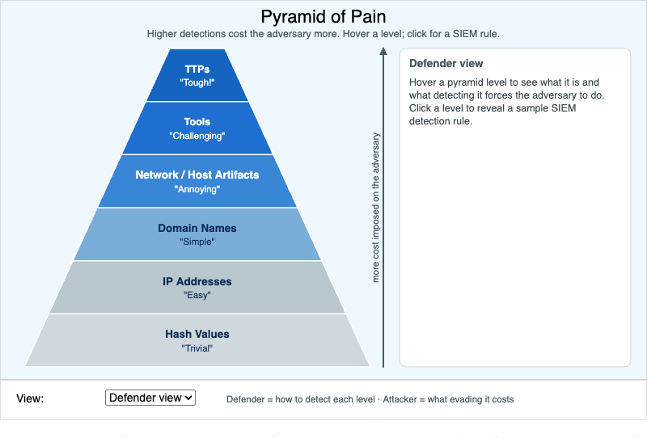

# Pyramid of Pain



<iframe src="main.html" width="100%" height="542" scrolling="no"></iframe>

[Run MicroSim in Fullscreen](main.html){ .md-button .md-button--primary }

You can include this MicroSim on your own page with the following `iframe`:

```html
<iframe src="https://dmccreary.github.io/cybersecurity/sims/pyramid-of-pain/main.html" height="542" width="100%" scrolling="no"></iframe>
```

## About this MicroSim

David Bianco's **Pyramid of Pain** ranks indicators of compromise by how much *pain*
it causes the adversary when a defender detects and blocks them. The six levels run
from **Hash Values** at the wide bottom ("Trivial" to change — flip one byte and the
hash is new) up through IP Addresses, Domain Names, Network/Host Artifacts, and Tools
to **TTPs** at the narrow top ("Tough!" — the adversary must change how they
fundamentally operate).

Hover any level to see what kind of indicator lives there and what detecting it
*forces the adversary to do*. Click a level to pin it and reveal a **sample SIEM
detection rule** for that level — for example, a behavioral rule at the TTP level
that fires when an Office application spawns `powershell.exe` with an encoded
command. The **view selector** switches between the **Defender view** (detection
ideas) and the **Attacker view** (what evading detection at that level actually
costs in time and money).

The takeaway the pyramid is designed to teach: blocking a file hash or an IP costs
the attacker seconds, but detecting their tools or — better still — their TTPs forces
expensive, slow rework. Spend your detection effort where it hurts the adversary
most. Move the mouse over a level to explore; the panel on the right updates as you go.

## Lesson Plan

**Learning objective (Bloom: Understand).** Students will explain why detecting
attackers at higher levels of the pyramid imposes more cost on the adversary than
detecting them at lower levels, and match a sample detection rule to its level.

**Suggested classroom use.** Give students a handful of indicators — a SHA-256 hash,
a C2 domain, a Cobalt Strike named pipe, an "encoded PowerShell from Word" behavior —
and have them place each at the right level and rank them by how much pain detection
would cause the attacker.

**Discussion questions:**

1. Why does blocking a known-bad file hash provide so little lasting protection?
2. TTP-level detections are the most valuable but also the hardest to write. Why, and
   what kind of telemetry do they usually require?
3. Most SIEM rules in practice target the bottom three levels. Given the pyramid,
   what does that say about where defenders should invest *more* effort?

## References

- [Indicator of compromise — Wikipedia](https://en.wikipedia.org/wiki/Indicator_of_compromise)
- [Pyramid of Pain — Malpedia / community description](https://en.wikipedia.org/wiki/Cyber_threat_intelligence)
- [Security information and event management — Wikipedia](https://en.wikipedia.org/wiki/Security_information_and_event_management)
- [MITRE ATT&CK — Wikipedia](https://en.wikipedia.org/wiki/MITRE_ATT%26CK)

## Specification

The full specification below is extracted from
[Chapter 15: "Offensive and Defensive Security Operations"](../../chapters/15-security-operations/index.md).

```text
Type: infographic
sim-id: pyramid-of-pain
Library: p5.js
Status: Specified

Learning objective (Bloom: Understand): Students will explain why detecting
attackers at higher levels of the pyramid imposes more cost on the adversary than
detecting them at lower levels.

A 6-level pyramid, narrowest at top: TTPs (Tough!), Tools (Challenging),
Network/Host Artifacts (Annoying), Domain Names (Simple), IP Addresses (Easy), Hash
Values (Trivial). Hovering each level expands a tooltip explaining what the
indicator is, what detecting it forces the adversary to do, and an example. Clicking
each level reveals a sample SIEM detection rule. A control toggles between a
Defender view (detection ideas) and an Attacker view (what evading detection at that
level costs).

Canvas 700x520, responsive via updateCanvasSize(); canvas parented to <main>.
```

## Related Resources

- [Chapter 15: "Offensive and Defensive Security Operations"](../../chapters/15-security-operations/index.md)
