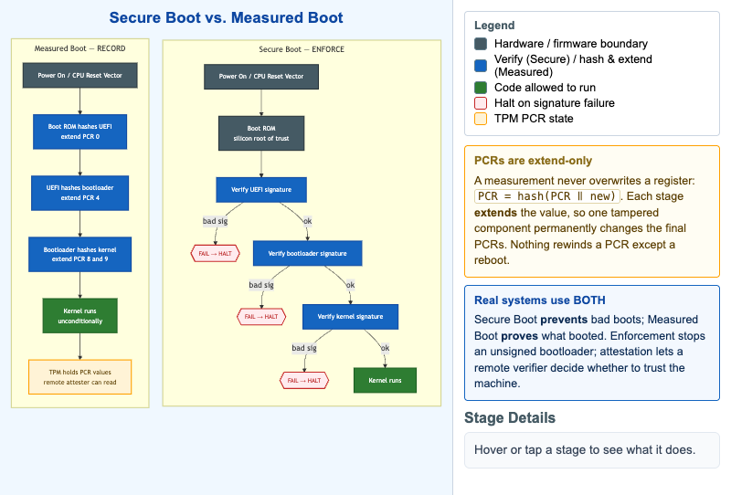

# Secure Boot vs. Measured Boot



<iframe src="main.html" width="100%" height="542" scrolling="no"></iframe>

[Run the Secure Boot vs. Measured Boot MicroSim Fullscreen](main.html){ .md-button .md-button--primary }

You can include this MicroSim on your own website with the following `iframe`:

```html
<iframe src="https://dmccreary.github.io/cybersecurity/sims/secure-vs-measured-boot/main.html" height="542" width="100%" scrolling="no"></iframe>
```

## About this MicroSim

This diagram places the two TPM-era boot integrity mechanisms side by side so
their fundamentally different jobs are obvious. Both start identically at power-on
and the CPU reset vector, and both root their trust in the immutable **Boot ROM**
baked into the silicon.

The **left column — Secure Boot** is *enforcement*. Each stage verifies the
cryptographic signature of the next before handing off control: Boot ROM checks
UEFI, UEFI checks the bootloader, the bootloader checks the kernel. A bad
signature at any step hits a red **FAIL → HALT** diamond and the machine refuses
to continue — fail-secure, not fail-open.

The **right column — Measured Boot** is *recording*. Each stage hashes the next
and **extends** a TPM Platform Configuration Register (PCR[0], PCR[4], PCR[8/9]),
then lets the boot continue **unconditionally**. After boot the TPM holds a set
of PCR values that fingerprint exactly what ran, which a remote attester can read
to decide whether to trust the machine. Hover (or tap) any stage to read what it
does. The amber callout explains why PCRs are *extend-only* — `PCR = hash(PCR ‖
new)` — so one tampered component permanently changes the result. The closing
caption is the key takeaway: real systems use **both** — Secure Boot prevents bad
boots, Measured Boot proves what booted. Below 700px the two columns stack.

## Lesson Plan

**Learning objective (Bloom — Understand):** Students can compare Secure Boot
with Measured Boot, explain what a PCR's extend-only property guarantees, and say
why production platforms run both.

**Suggested classroom use:** Walk the left column first and pause at each FAIL
diamond — ask "what does the machine do here, and why is halting the safe
choice?" Then walk the right column and ask the inverse: "why is it useful to let
a possibly-bad component run, as long as you measure it?" Land on the caption.

**Discussion questions:**

1. Measured Boot lets an unsigned kernel run. How is the resulting PCR set still
   useful to a remote verifier?
2. An attacker swaps in a malicious bootloader. Trace how Secure Boot and
   Measured Boot each respond.
3. Why must the root of trust live in immutable silicon rather than in
   reflashable firmware?

## References

- [Unified Extensible Firmware Interface — Secure Boot (Wikipedia)](https://en.wikipedia.org/wiki/UEFI#Secure_Boot)
- [Trusted Platform Module (Wikipedia)](https://en.wikipedia.org/wiki/Trusted_Platform_Module)
- [Trusted boot / measured boot (Wikipedia)](https://en.wikipedia.org/wiki/Trusted_boot)

## Specification

The full specification below is extracted from
[Chapter 7: "Component and Hardware Security"](../../chapters/07-component-security/index.md).

```text
Type: workflow-diagram
**sim-id:** secure-vs-measured-boot<br/>
**Library:** Mermaid<br/>
**Status:** Specified

Two parallel vertical flows side by side, both starting from "Power On" at the top.

**Left column: Secure Boot (enforcement)**

1. Power On → CPU Reset Vector
2. Boot ROM (immutable, the silicon root of trust)
3. Verifies signature of UEFI firmware → if FAIL, halt (red diamond)
4. UEFI verifies signature of bootloader → if FAIL, halt (red diamond)
5. Bootloader verifies kernel signature → if FAIL, halt (red diamond)
6. Kernel runs

Each step is colored cybersecurity blue with a green "verify" annotation; failure paths show a red halt diamond.

**Right column: Measured Boot (recording)**

1. Power On → CPU Reset Vector
2. Boot ROM hashes UEFI firmware → extends PCR[0]
3. UEFI hashes bootloader → extends PCR[4]
4. Bootloader hashes kernel/initrd → extends PCR[8/9]
5. Kernel runs (unconditionally)
6. After boot: TPM holds PCR values that fingerprint the boot

Each step shows a small "PCR" register box on the right that accumulates hash values; the final state can be read by a remote attester.

Below both columns: a caption "Real systems use BOTH — Secure Boot prevents bad boots; Measured Boot proves what booted."

Color: cybersecurity blue for trusted stages, slate steel for hardware/firmware boundaries, amber for the warning that PCRs are extend-only.

Responsive: two columns collapse to stacked sequence below 700px.

Implementation: Mermaid two flowcharts side by side via `flowchart TB` with subgraphs.
```

## Related Resources

- [Chapter 7: "Component and Hardware Security"](../../chapters/07-component-security/index.md)
