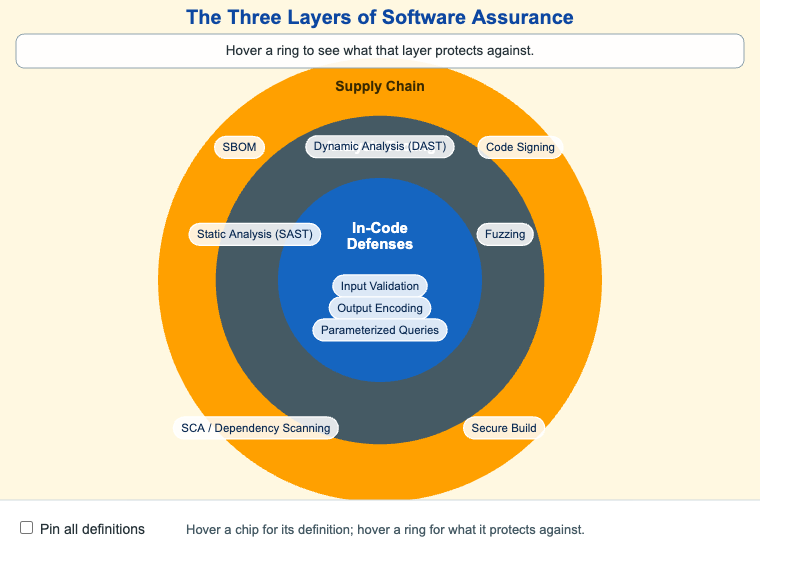

# The Three Layers of Software Assurance



<iframe src="main.html" width="100%" height="562" scrolling="no"></iframe>

[Run MicroSim in Fullscreen](main.html){ .md-button .md-button--primary }

You can include this MicroSim on your own page with the following `iframe`:

```html
<iframe src="https://dmccreary.github.io/cybersecurity/sims/software-assurance-layers/main.html" height="562" width="100%" scrolling="no"></iframe>
```

## About this MicroSim

This infographic shows software assurance as three concentric layers that compose
to defend a system, drawn from the inside out. At the center, in cybersecurity
blue, are the **In-Code Defenses** — input validation, output encoding, and
parameterized queries — controls that live inside the program and stop abuse right
at the trust boundary. Surrounding them, in slate steel, is the **Analysis
Tooling** ring: static analysis (SAST), dynamic analysis (DAST), and fuzzing, which
find the defects a developer missed. The outermost amber ring is the **Supply
Chain** layer: dependency scanning (SCA), the SBOM, code signing, and a secure
build pipeline — the controls that defend the code you did not write.

The concentric arrangement is deliberate. Each outer ring is a backstop for the one
inside it: if a developer forgets to parameterize a query, analysis tooling should
catch it; if a vulnerable dependency slips past review, supply-chain scanning
should flag it. No single ring is sufficient on its own.

Hover any chip to read its one-line definition, or hover a ring to update the
caption at the top with what that layer protects against. Toggle **Pin all
definitions** to study every control at once. Because the goal here is to
*understand* how the layers relate — not to tune a parameter — the MicroSim is
hover-driven rather than animated.

## Lesson Plan

**Learning objective (Bloom: Understand).** Students will explain how the three
layers of software assurance compose to defend a system, match each control to its
layer, and articulate which layer fails when a particular incident occurs.

**Suggested classroom use.** Describe three incidents — "a SQL injection returned
the whole users table," "a shipped release contained a dependency with a known
CVE," "an attacker tampered with an artifact between build and deploy." For each,
have students point to the ring whose control should have prevented it, then name a
second ring that could have served as a backstop.

**Discussion questions:**

1. Why are these layers drawn as concentric rings instead of a flat list? What does
   the nesting communicate that a checklist would not?
2. A team has excellent SAST coverage but no SBOM. Which incidents are they still
   exposed to, and why does the missing outer ring matter?
3. In-code defenses and analysis tooling both target the code the team wrote. What
   makes the supply-chain ring fundamentally different?

## References

- [Software assurance — Wikipedia](https://en.wikipedia.org/wiki/Software_assurance)
- [Static application security testing — Wikipedia](https://en.wikipedia.org/wiki/Static_application_security_testing)
- [Dynamic application security testing — Wikipedia](https://en.wikipedia.org/wiki/Dynamic_application_security_testing)
- [SQL injection — Wikipedia](https://en.wikipedia.org/wiki/SQL_injection)

## Specification

The full specification below is extracted from
[Chapter 6: "Software Assurance and Supply Chain Security"](../../chapters/06-software-assurance/index.md).

```text
Type: infographic
**sim-id:** software-assurance-layers
**Library:** p5.js
**Status:** Specified

Three concentric circles on a 720x480 responsive canvas (resizes to container width).

- Inner circle (cybersecurity blue #1565c0, label "In-Code Defenses"): three chips: "Input Validation", "Output Encoding", "Parameterized Queries"
- Middle ring (slate steel #455a64, label "Analysis Tooling"): three chips: "Static Analysis (SAST)", "Dynamic Analysis (DAST)", "Fuzzing"
- Outer ring (amber alert accent #ffa000, label "Supply Chain"): four chips: "SCA / Dependency Scanning", "SBOM", "Code Signing", "Secure Build"

Hovering on any chip shows a 1-line tooltip with the definition (matching the glossary). A small "What this layer protects against" caption updates as the user hovers a ring.

Learning objective (Bloom - Understand): explain how the three layers compose to defend a software system, and articulate which layer fails when a particular incident occurs.

Responsive: collapses to vertical stack of three labeled bands below 600px viewport.

Implementation: p5.js sketch with updateCanvasSize() first in setup(), canvas.parent(document.querySelector('main')), mouse-hover tooltips drawn on top.
```

## Related Resources

- [Chapter 6: "Software Assurance and Supply Chain Security"](../../chapters/06-software-assurance/index.md)
