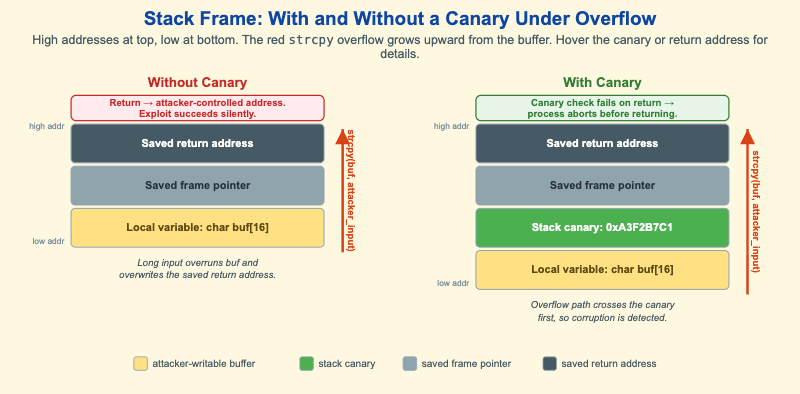

# Stack Frame With and Without a Canary Under Overflow



<iframe src="main.html" width="100%" height="394" scrolling="no"></iframe>

[Run MicroSim in Fullscreen](main.html){ .md-button .md-button--primary }

You can include this MicroSim on your own page with the following `iframe`:

```html
<iframe src="https://dmccreary.github.io/cybersecurity/sims/stack-canary-comparison/main.html" height="394" width="100%" scrolling="no"></iframe>
```

## About this MicroSim

This diagram puts two stack frames side by side so you can see exactly what a
**stack canary** changes. Both frames are drawn the standard way: high memory
addresses at the top, low addresses at the bottom, with the local buffer
`char buf[16]` at the bottom and the saved return address at the top. In both, the
same red arrow represents `strcpy(buf, attacker_input)` — an unbounded copy that
grows *upward* from the buffer when the input is longer than 16 bytes.

In the **left frame (Without Canary)**, nothing sits between the buffer and the
saved registers. A long input overruns `buf`, overwrites the saved frame pointer,
and then overwrites the saved return address. When the function returns, the CPU
jumps to an attacker-controlled address — and because nothing was checked, the
exploit succeeds *silently*.

In the **right frame (With Canary)**, the compiler has inserted a random per-process
**stack canary** (shown in green) directly above the buffer. The overflow path now
crosses the canary *first*. Before the function returns, the prologue's matching
epilogue check compares the canary against its known value, finds it corrupted, and
aborts the process. The attacker may still corrupt memory, but they cannot return
into their payload undetected. Hover the canary or either saved return address to
read what each region is and why it matters.

## Lesson Plan

**Learning objective (Bloom: Understand).** Students will explain how a stack
overflow overwrites the saved return address, compare the two frames, and articulate
why a canary turns a silent compromise into a safe abort.

**Suggested classroom use.** Project both frames and trace the red arrow in each,
asking the class to call out the first region the overflow reaches that the
defender *cares* about. In the left frame that is the return address; in the right
frame it is the canary. Emphasize the subtle point: the canary does not stop the
write — it makes the corruption *detectable* before the dangerous return.

**Discussion questions:**

1. A canary does not prevent the buffer overflow itself. What exactly does it
   prevent, and at what moment is it checked?
2. Why must the canary value be random and per-process rather than a fixed constant
   compiled into the binary?
3. An attacker who can read memory before overflowing might leak the canary value.
   How does that defeat the protection, and what other defense would still help?

## References

- [Stack buffer overflow — Wikipedia](https://en.wikipedia.org/wiki/Stack_buffer_overflow)
- [Buffer overflow protection — Wikipedia](https://en.wikipedia.org/wiki/Buffer_overflow_protection)
- [Stack canary (Buffer overflow protection) — Wikipedia](https://en.wikipedia.org/wiki/Buffer_overflow_protection#Canaries)
- [Call stack — Wikipedia](https://en.wikipedia.org/wiki/Call_stack)

## Specification

The full specification below is extracted from
[Chapter 10: "System Security: OS, Memory, and Access Control"](../../chapters/10-system-security/index.md).

```text
Type: infographic
**sim-id:** stack-canary-comparison
**Library:** Static SVG with hover tooltips
**Status:** Specified

Two stack frames shown side by side, drawn vertically with high-address at top and low-address at bottom (the standard stack layout).

Left frame - "Without Canary": Saved return address (dark gray), Saved frame pointer (gray), Local variable char buf[16] (yellow). Below it a red arrow labeled "strcpy(buf, attacker_input)" pointing upward. Annotation: "Long input overruns buf, overwrites saved return address". Result label: "Return -> attacker-controlled address. Exploit succeeds silently."

Right frame - "With Canary": Saved return address (dark gray), Saved frame pointer (gray), Stack canary 0xA3F2B7C1 (green), Local variable char buf[16] (yellow). Same red overflow arrow. Annotation: "Overflow path crosses canary first". Result label: "Canary check fails on return -> process aborts before return".

A legend below explains the colors: yellow = attacker-writable buffer, green = canary, gray = saved frame pointer, dark gray = saved return address.

Hover tooltips:
- Canary box: "A random per-process value. Compiler inserts; prologue checks."
- Saved return address: "Where the function returns to. Hijacking this is the classic exploit goal."

Color: amber accent on the "exploit succeeds" label, green on the canary, slate steel for return address, light yellow for buffer. Responsive: side-by-side at >800px, stacked vertically below.

Implementation: Static SVG.
```

## Related Resources

- [Chapter 10: "System Security: OS, Memory, and Access Control"](../../chapters/10-system-security/index.md)
