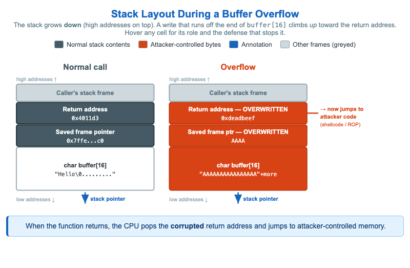

# Stack Layout During a Buffer Overflow



<iframe src="main.html" width="100%" height="522" scrolling="no"></iframe>

[Run MicroSim in Fullscreen](main.html){ .md-button .md-button--primary }

You can include this MicroSim on your own page with the following `iframe`:

```html
<iframe src="https://dmccreary.github.io/cybersecurity/sims/stack-overflow-anatomy/main.html" height="522" width="100%" scrolling="no"></iframe>
```

## About this MicroSim

This infographic places two stack frames side by side, both drawn in the
conventional **stack-grows-down** orientation: high addresses at the top, low
addresses at the bottom, with the stack pointer at the very bottom. On the
**left ("Normal call")**, a 16-byte local array `buffer[16]` holds the string
`"Hello\0..."`, and above it the **saved frame pointer** and the **return
address** (`0x4011d3`, slate) are intact — a bounds-checked write stayed inside
the buffer.

On the **right ("Overflow")**, an unbounded write has filled `buffer[16]` with
`"AAAA..."` and kept going *up* the stack, painting the saved frame pointer and
then the return address red. The return address is now the attacker-chosen value
`0xdeadbeef`, and the red annotation shows the consequence: when the function
returns, the CPU pops that corrupted address and **jumps to attacker-controlled
memory** (shellcode or a ROP chain). Hover over (or tap) any cell to read what it
holds and which mitigation — a **stack canary** placed just below the return
address, **ASLR** to randomize the target, or **DEP/NX** to forbid executing the
stack — would have detected or prevented the attack at that point. The blue
caption restates the core mechanism.

## Lesson Plan

**Learning objective (Bloom: Understand).** Students will explain how an
unbounded write to a fixed-size stack buffer overwrites the saved frame pointer
and return address, why that redirects execution on function return, and which
mitigations would have stopped it.

**Suggested classroom use.** Project the two panels and read the overflow from
the bottom up: start at `buffer[16]`, then the saved frame pointer, then the
return address, narrating how each red cell is reached as the write continues
past 16 bytes. Then hover each red cell and have students name the defense that
acts at that location, distinguishing controls that *detect* (stack canary) from
those that *prevent exploitation* (ASLR, DEP/NX).

**Discussion questions:**

1. Why does the saved frame pointer get corrupted *before* the return address,
   and why does that ordering make the stack canary's placement effective?
2. DEP/NX prevents executing shellcode placed on the stack. Why does that not
   fully defeat overflow exploitation, and what technique works around it?
3. The root cause is a missing bounds check. If you could fix exactly one thing
   in the vulnerable code, what would it be — and why is that better than relying
   on canary, ASLR, and DEP together?

## References

- [Buffer overflow — Wikipedia](https://en.wikipedia.org/wiki/Buffer_overflow)
- [Stack buffer overflow — Wikipedia](https://en.wikipedia.org/wiki/Stack_buffer_overflow)
- [Stack canary / buffer overflow protection — Wikipedia](https://en.wikipedia.org/wiki/Buffer_overflow_protection)
- [Address space layout randomization (ASLR) — Wikipedia](https://en.wikipedia.org/wiki/Address_space_layout_randomization)

## Specification

The full specification below is extracted from
[Chapter 5: "Software Vulnerabilities and Secure Coding"](../../chapters/05-software-vulnerabilities/index.md).

```text
Type: infographic-svg
sim-id: stack-overflow-anatomy
Library: Static SVG with hover tooltips
Status: Specified

A side-by-side comparison of two stack frames, drawn vertically with high addresses at the top and low addresses at the bottom (the conventional stack-grows-down orientation).

Left panel: "Normal call"
From top to bottom of the stack frame:
- Caller's stack (greyed out)
- Return address (slate #455a64, labeled "Return address: 0x4011d3")
- Saved frame pointer (slate)
- buffer[16] (16 cells, white, contents: "Hello\0...")
- Stack pointer arrow at bottom

Right panel: "Overflow"
Same layout, but:
- buffer[16] is fully filled with "AAAA..." in red (#d84315)
- Saved frame pointer is overwritten with "AAAA" in red
- Return address is overwritten with attacker-chosen address "0xdeadbeef" in red
- An annotation arrow points from the return address to "-> now jumps to attacker code (shellcode or ROP chain)"

A caption below: "When the function returns, the CPU pops the (corrupted) return address and jumps to attacker-controlled memory."

Hovering on each cell shows the byte address and what defenses (stack canary, ASLR, DEP) would have stopped it.

Color palette: slate steel for normal stack contents, rust orange/red for attacker-controlled bytes, cybersecurity blue for annotations.

Responsive: panels stack vertically below 700px.

Implementation: Static SVG with title tooltips on each labeled region.
```

## Related Resources

- [Chapter 5: "Software Vulnerabilities and Secure Coding"](../../chapters/05-software-vulnerabilities/index.md)
