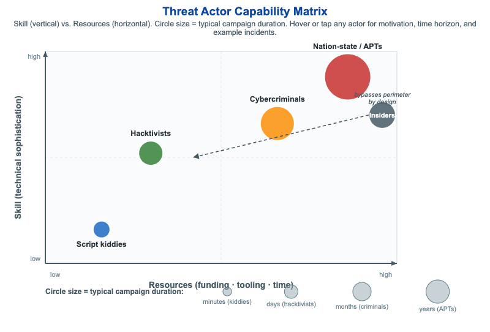

# Threat Actor Capability Matrix



<iframe src="main.html" width="100%" height="542" scrolling="no"></iframe>

[Run MicroSim in Fullscreen](main.html){ .md-button .md-button--primary }

You can include this MicroSim on your own page with the following `iframe`:

```html
<iframe src="https://dmccreary.github.io/cybersecurity/sims/threat-actor-matrix/main.html" height="542" width="100%" scrolling="no"></iframe>
```

## About this MicroSim

This MicroSim plots five common **threat actor** types on a two-dimensional
matrix: the horizontal axis is **Resources** (funding, tooling, and time) and the
vertical axis is **Skill** (technical sophistication). Each actor is drawn as a
circle whose **size encodes its typical campaign duration** — script kiddies act
in minutes, while nation-state APTs run patient campaigns over years. Hovering or
tapping any circle reveals a tooltip with that actor's typical motivation, time
horizon, and real-world example incidents.

The plot makes the central insight visible at a glance: the most dangerous actors
cluster in the **upper-right** quadrant, where high skill *and* deep resources let
them sustain long, targeted campaigns. **Script kiddies** sit lower-left (low skill,
low resources, opportunistic), **hacktivists** are mid-left (ideologically driven,
moderate skill), and **cybercriminals** occupy the middle-right (profit-motivated,
well-resourced). **Insiders** are deliberately drawn *off* the skill/resources axes
with a callout arrow reading "bypasses perimeter by design" — their threat is not
sophistication but trusted **access**, which is why they need their own treatment in
any threat model.

## Lesson Plan

**Learning objective (Bloom: Analyze).** Students will place common threat actor
types on a Skill vs. Resources matrix, compare them by motivation, time horizon,
and example incidents, and explain why insiders are an off-axis threat that bypasses
the perimeter by design.

**Suggested classroom use.** Project the matrix and ask students, before revealing
tooltips, to predict where each actor belongs and why. Then hover each circle to
check their reasoning. Connect circle size to defensive posture: a defender's mean
time to detect must be shorter than the attacker's dwell time — easy against minutes-
long script-kiddie noise, very hard against a multi-year APT campaign.

**Discussion questions:**

1. Two actors can sit at the same skill level but very different resource levels.
   How does that change the kind of attack each can sustain, and the defense you need?
2. Why are insiders modeled off the skill/resources axes instead of as just another
   point on the plot? What control assumptions do they break?
3. The most damaging breaches often come from the upper-right (APTs) — but the most
   *frequent* attacks come from the lower-left. How should that shape where a small
   organization spends its limited security budget?

## References

- [Threat actor — Wikipedia](https://en.wikipedia.org/wiki/Threat_actor)
- [Advanced persistent threat — Wikipedia](https://en.wikipedia.org/wiki/Advanced_persistent_threat)
- [Hacktivism — Wikipedia](https://en.wikipedia.org/wiki/Hacktivism)
- [Insider threat — Wikipedia](https://en.wikipedia.org/wiki/Insider_threat)

## Specification

The full specification below is extracted from
[Chapter 2: "Threats, Vulnerabilities, and Security Controls"](../../chapters/02-threats-and-controls/index.md).

```text
Type: infographic-svg
**sim-id:** threat-actor-matrix
**Library:** Static SVG with hover tooltips
**Status:** Specified

A 2D scatter plot:
- X-axis: Resources (low -> high)
- Y-axis: Skill (low -> high)

Five labeled circles positioned in the appropriate quadrants:
- Script kiddies (low skill, low resources, lower-left): blue #1565c0, small radius
- Hacktivists (mixed skill, low-moderate resources, middle-left): green, medium radius
- Cybercriminals (high skill, moderate-high resources, middle-right): orange #fb8c00, larger radius
- Insiders (variable skill, low resources but unique access, special placement on a separate annotation): slate steel #455a64, with a callout arrow indicating "bypasses perimeter by design"
- Nation-state actors / APTs (highest skill, highest resources, upper-right): red #c62828, largest radius

Each circle has a hover tooltip listing typical motivations, time horizons, and example incidents. A legend at the bottom maps circle size to "typical campaign duration" (kiddies = minutes, APTs = years).

Color background should be neutral white. Responsive design that reflows axes at narrow widths.

Implementation: Static SVG with `<title>` elements; could be enhanced later as a clickable infographic.
```

## Related Resources

- [Chapter 2: "Threats, Vulnerabilities, and Security Controls"](../../chapters/02-threats-and-controls/index.md)
