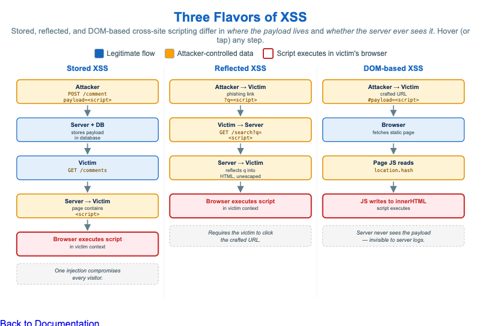

# Three Flavors of XSS



<iframe src="main.html" width="100%" height="542" scrolling="no"></iframe>

[Run the Three Flavors of XSS MicroSim Fullscreen](main.html){ .md-button .md-button--primary }

You can include this MicroSim on your own website with the following `iframe`:

```html
<iframe src="https://dmccreary.github.io/cybersecurity/sims/xss-three-flavors/main.html" height="542" width="100%" scrolling="no"></iframe>
```

## About this MicroSim

Cross-site scripting (XSS) is one bug class with three meaningfully different
shapes, and the difference is *where the attacker's payload lives* and *whether
the server ever touches it*. This infographic lays the three subtypes side by
side as data-flow columns so the contrast is visible at a glance.

**Stored XSS** (left) saves the payload on the server — one injected comment is
then served to *every* later visitor, so the attacker needs no further action.
**Reflected XSS** (middle) carries the payload in a request and the server echoes
it straight back into the response, so it only fires when a victim clicks the
crafted link. **DOM-based XSS** (right) is the sneaky one: the payload rides in
the URL fragment (`#...`), which browsers never send to the server, and a
vulnerable piece of client-side JavaScript reads it from a *source*
(`location.hash`) and writes it into a dangerous *sink* (`innerHTML`) — so the
attack can be completely **invisible to server logs**.

Every box is color-coded: **blue** for a legitimate flow, **amber** for
attacker-controlled data, and a **red outline** on the box where the script
finally executes in the victim's browser. Hover (or tap on touch devices) any
step to read exactly what happens and why it is dangerous. The layout is
responsive — below about 860px wide the three columns stack vertically while
keeping every tooltip.

## Lesson Plan

**Learning objective (Bloom — Understand / compare):** Students can compare the
data flow of stored, reflected, and DOM-based XSS, state where the payload lives
in each, and explain why DOM-based XSS can evade server-side logging.

**Suggested classroom use:** Walk the three columns left to right, hovering each
step. Pause at the "Server" boxes and ask which subtype's server is *innocent*
(DOM-based — it served an unmodified page). Connect the red "executes" box in all
three to the single shared defense: contextual output encoding and avoiding
dangerous sinks like `innerHTML`.

**Discussion questions:**

1. A defender greps the web server's access logs for `<script>` and finds
   nothing, yet users are being compromised. Which XSS subtype best explains
   this, and why?
2. Stored XSS needs no victim action while reflected XSS does. What is it about
   the data flow that creates that difference?
3. Output encoding fixes stored and reflected XSS at the server. Why is it not
   enough for DOM-based XSS, and what changes?

## References

- [Cross-site scripting (Wikipedia)](https://en.wikipedia.org/wiki/Cross-site_scripting)
- [Types of XSS — OWASP](https://owasp.org/www-community/Types_of_Cross-Site_Scripting)
- [DOM-based XSS — OWASP](https://owasp.org/www-community/attacks/DOM_Based_XSS)
- [XSS Prevention Cheat Sheet — OWASP](https://cheatsheetseries.owasp.org/cheatsheets/Cross_Site_Scripting_Prevention_Cheat_Sheet.html)

## Specification

The full specification below is extracted from
[Chapter 5: "Software Vulnerabilities and Secure Coding"](../../chapters/05-software-vulnerabilities/index.md).

```text
Type: infographic-svg
**sim-id:** xss-three-flavors<br/>
**Library:** Static SVG with hover tooltips<br/>
**Status:** Specified

A three-column infographic, one column per XSS subtype, each showing the data flow as a sequence of actors and arrows.

**Column 1: Stored XSS**

Actors top-to-bottom: Attacker → Server (with database icon) → Victim browser

Arrows:
1. Attacker → Server: "POST /comment payload=`<script>...</script>`"
2. Server stores payload in database
3. Victim → Server: "GET /comments"
4. Server → Victim: "page contains `<script>...</script>`"
5. Victim browser executes script

Caption: "One injection compromises every visitor."

**Column 2: Reflected XSS**

Actors: Attacker → Victim → Server → Victim browser

Arrows:
1. Attacker → Victim: "Phishing email with crafted link `?q=<script>...</script>`"
2. Victim → Server: "GET /search?q=`<script>...</script>`"
3. Server → Victim: "Search results page reflects `q` into HTML without escaping"
4. Victim browser executes script

Caption: "Requires the victim to click the crafted URL."

**Column 3: DOM-based XSS**

Actors: Attacker → Victim → Browser only (no server interaction)

Arrows:
1. Attacker → Victim: "Crafted URL `https://site/#payload=<script>...</script>`"
2. Victim browser fetches static page
3. Page's JavaScript reads `location.hash`
4. Page's JavaScript writes hash into `innerHTML` → script executes

Caption: "Server never sees the payload — invisible to server logs."

Color: cybersecurity blue for legitimate flows, alert amber `#ffa000` for attacker-controlled data, red outline on the "executes script" box.

Responsive: columns stack vertically below 900px.

Implementation: Static SVG with consistent layout, `<title>` tooltips on each step.
```

## Related Resources

- [Chapter 5: "Software Vulnerabilities and Secure Coding"](../../chapters/05-software-vulnerabilities/index.md)
